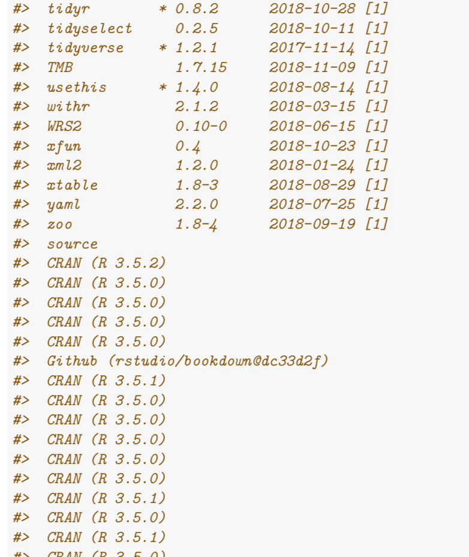

Writing a technical or academic report, or even a presentation, it is sensible to render the (R) code in such a writing reproducible. Same thing applies when asking for help at StackOverflow: you'll be asked for a [reprex](https://github.com/tidyverse/reprex).


One aspect for rendering a report reproducible is to include details on the version of packages needed. The well-known command `sessionInf()` provides the building blocks for that. However, the output of that function can feel verbose, and it consumes a lot of space.


A similar functionality is provided by `sessioninfo::session_info()`, is also allows for a more fine grained control of the output. However, it also can provide too much information when called without fine tuning. It also does not line wrap its output:

```{r echo = FALSE}

```


Maybe a cleaner output is achieved if we print only the packages along with their versions, and that as normal text, not formatted as R output.


As an example, let's load some arbitrary packages.


```{r message= FALSE, warning = FALSE}
library(tidyverse)
library(mosaic)
library(plotly)
library(ggrepel)
library(knitr)
library(DiagrammeR)
```


Then let's extract the loaded packages along with their versions.


```{r}
si <- sessioninfo::session_info()
pckgs <- map2(si$packages$package, 
              si$packages$loadedversion,
     ~ paste0(.x, " ", .y)) %>% 
  simplify()
```


Finally, print the stuff using this inline code:


```{r eval = FALSE}
- Date: `r si$platform$date`
- Packages: `r pckgs`
- OS: `r si$platform$os`
- Version: `r si$platform$version`
```


And that's how it could look like:


- Date: `r si$platform$date`
- Packages: `r pckgs`
- OS: `r si$platform$os`
- Version: `r si$platform$version`
