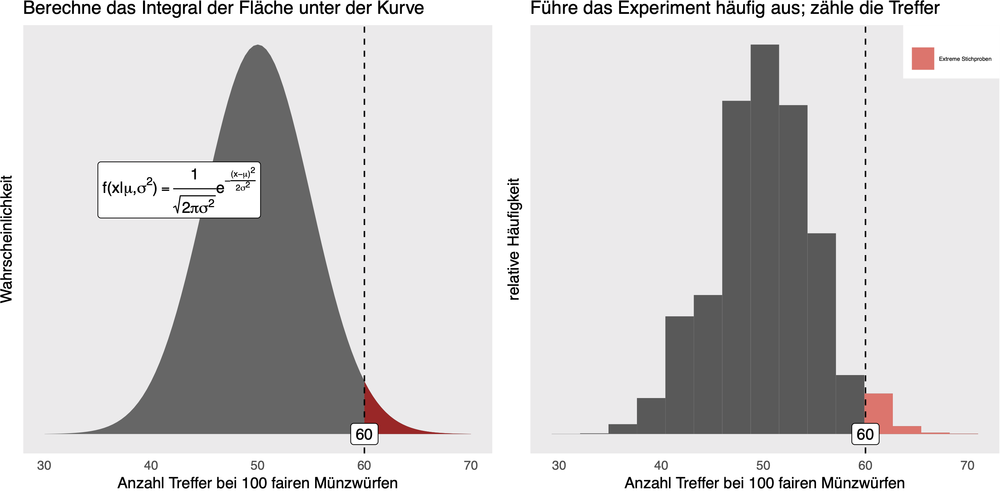
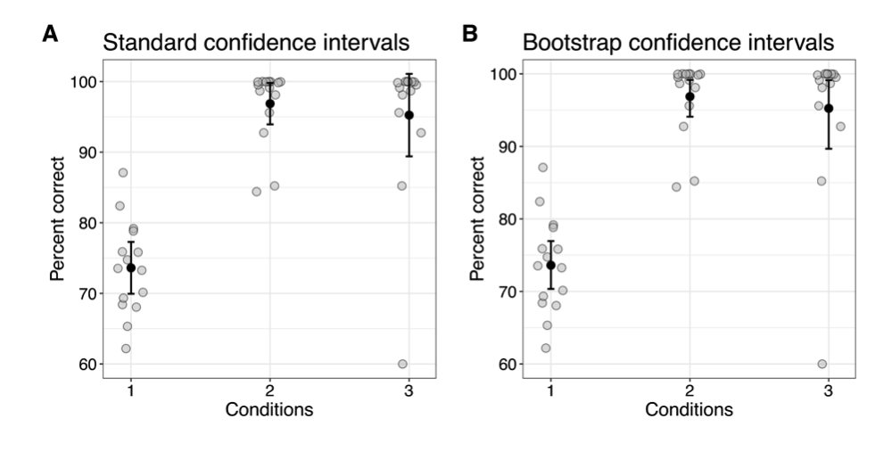
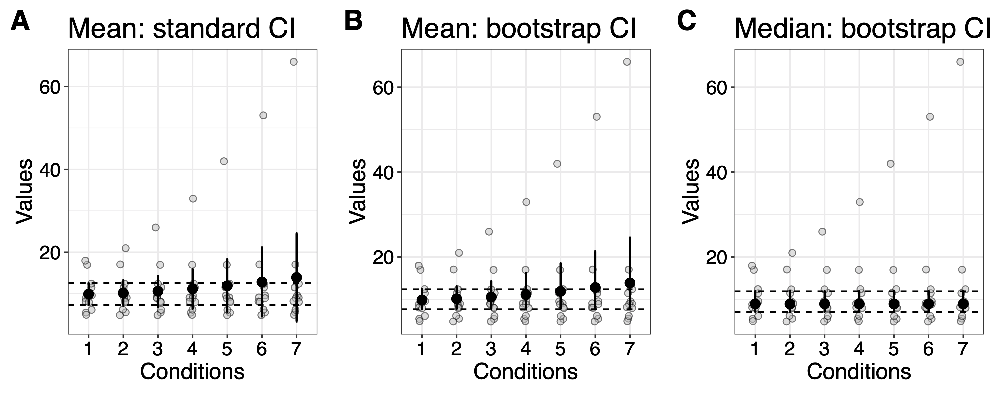
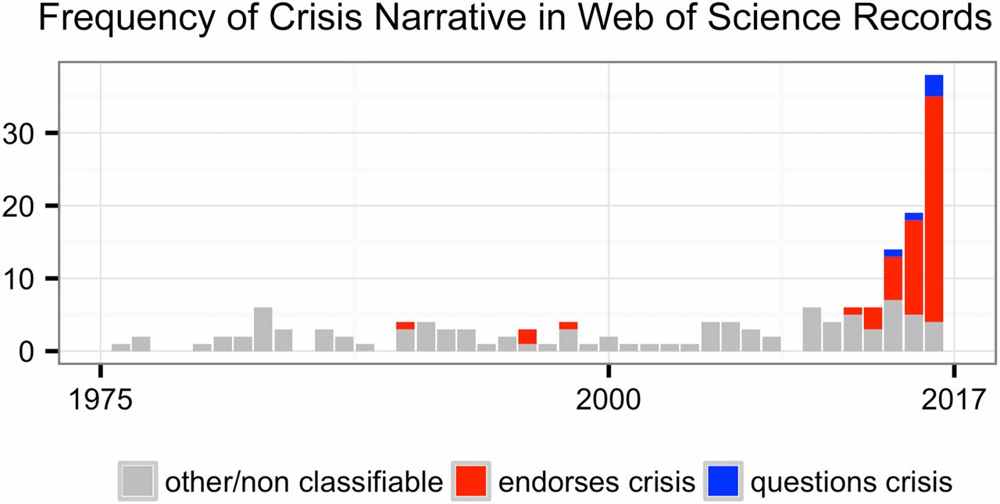
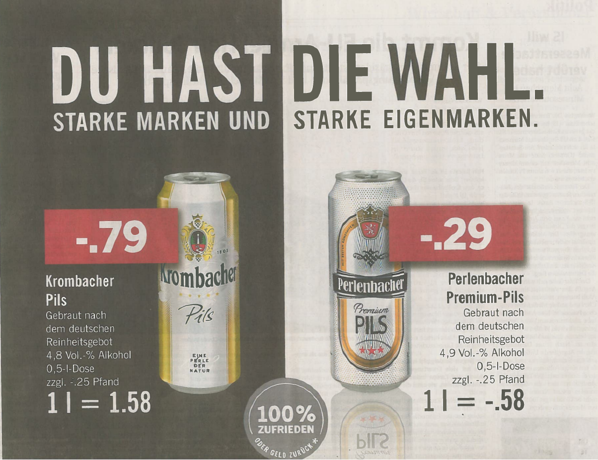
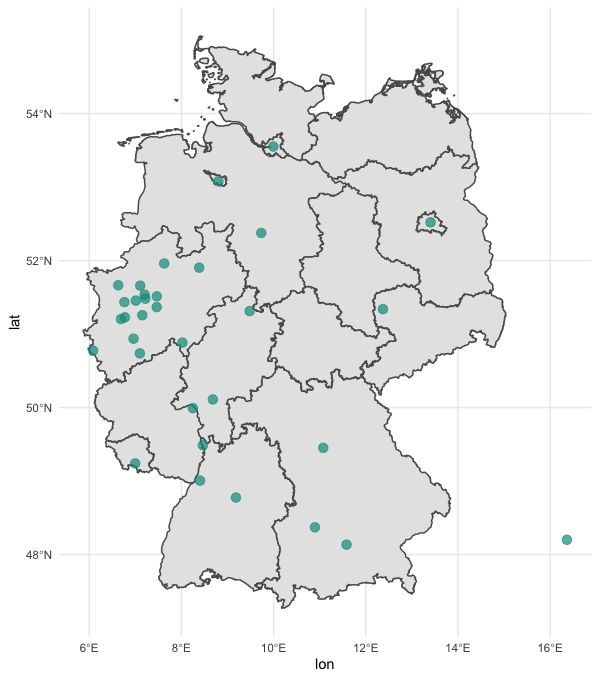
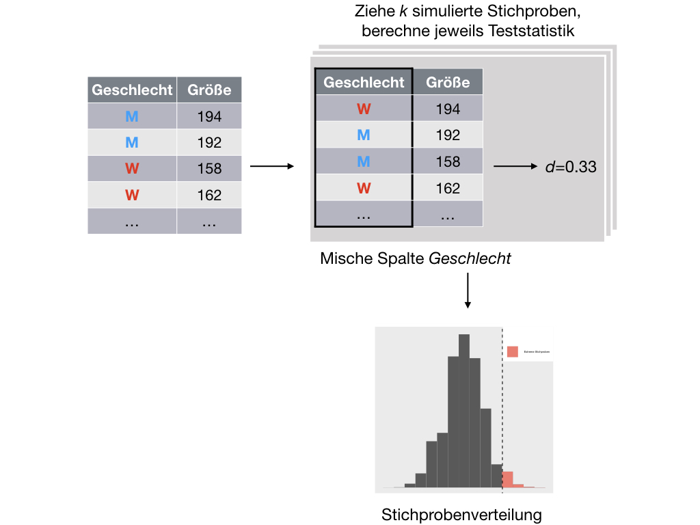
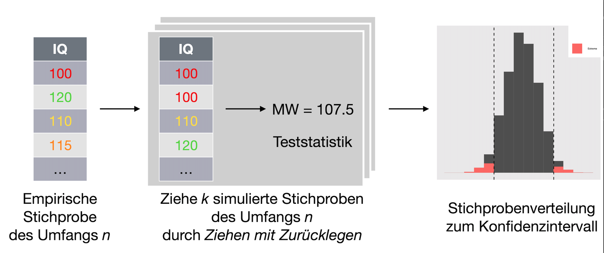
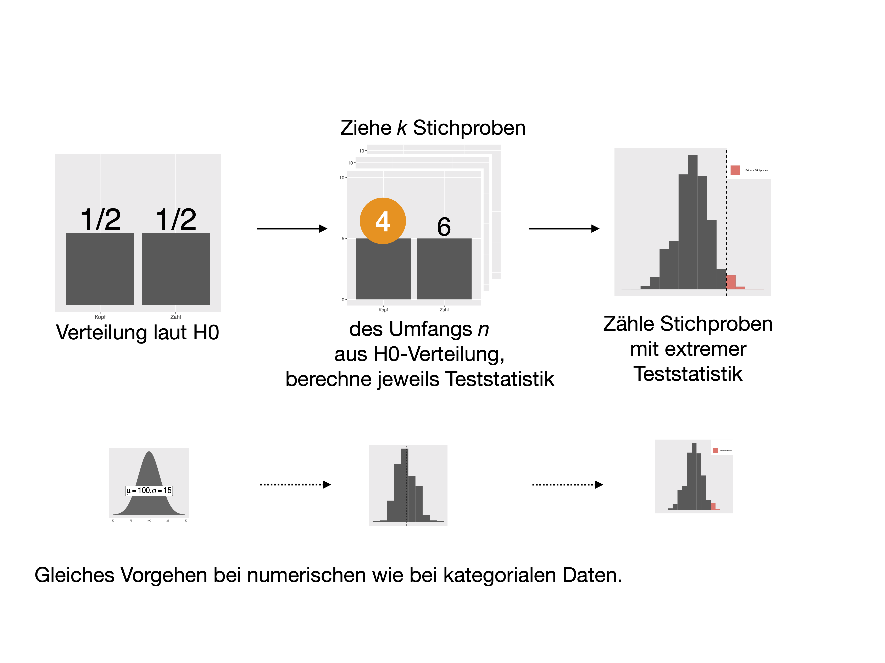

```{r child = "header-footer.Rmd"}
```

```{r load-libs, echo = FALSE, message = FALSE}
library(tidyverse)
library(icon)  # devtools::install_github("ropenscilabs/icon")
#library(waffle)
#library(sf)
library(emo)
library(stringr)
#library(DT)
library(knitr)
#library(plotly)
library(mosaic)
#library(kableExtra)
library(cowplot)
```


```{r knitr-setup, echo = FALSE}

options(width=80)


knitr::opts_chunk$set(
  comment = "#>",
  collapse = TRUE,
  message = FALSE,
  warning = FALSE,
  cache = TRUE,
  out.width = "70%",
  fig.align = 'center',
  fig.width = 6,
  fig.asp =  0.618,  # 1 / phi
  fig.show = "hold",
  size = "small",
  dpi = 300,
  echo = FALSE
)
```


<!-- Define an automatic count for header 1/2/exercises -->
```{r count-fun, echo = FALSE, cache=FALSE}
h1_count <<- 0

h1 <- function() {
  h1_count <<- h1_count + 1
  return(h1_count)
}


h2_count <<- 0

h2 <- function() {
  h2_count <<- h2_count + 1
  retuern(h2_count)
}

exercise_count <<- 0

ex <- function() {
  exercise_count <<- exercise_count + 1
  retuern(exercise_count)
}
```

---


## Agenda


.right-column[
.vcenter[

### .grey[1]. Wozu  Simulationstechniken?

### .grey[2]. Der Biertest -- Konfidenzintervall

### .grey[3]. Der Pringels-Test -- Hypothesen testen, Teil 1 

### .grey[4]. Die Lächelstudie -- Hypothesen testen, Teil 2

### .grey[5]. Fazit

]
]


---


class: section

# .grey.xlarge[`r h1()`] Wozu Simulationstechniken?


---


## Simu ... was?


</br>
</br>

### Simulationstechniken in der Datenanalyse nutzen die Stichprobendaten, um inferenzstatistische Schlüsse zu ziehen.


.pull-left[

### *Didaktiver* Nutzen:

A) weniger abstrakt

B) EIN Verfahren für (fast) alle Situationen
]


.pull-right[

### *Inhaltlicher* Nutzen

A) Manchmal präziser

B) Manchmal gibt es keine andere Möglichkeit]


---


## Verteilungsbasiert       vs. simulationsbasiert


</br>
</br>
</br>

```{r img-simu-vs-analyse, out.width="90%"}

```


---

## Verteilungsannahmen

### ... können falsch sein


```{r plot-percent-data-boot, }

```


.footnote[Rousselet, G. A., Pernet, C. R., & Wilcox, R. R. (2019). A practical introduction to the bootstrap: A versatile method to make inferences by using data-driven simulations [Preprint]. PsyArXiv. https://doi.org/10.31234/osf.io/h8ft7]


---

## Der *t*-Test bei schiefen Verteilungen (I/II)


```{r}
set.seed(21) # reproducible results
n <- 20 # sample size
samp <- rnorm(n) # get normal sample
nboot <- 1000 # number of bootstrap samples

# declare vector of results
boot.m <- vector(mode = "numeric", length = nboot) # save means
boot.tm <- vector(mode = "numeric", length = nboot) # save trimmed means
boot.md <- vector(mode = "numeric", length = nboot) # save medians

for(B in 1:nboot){
  boot.samp <- sample(samp, n, replace = TRUE) # sample with replacement
  boot.m[B] <- mean(boot.samp)
  boot.tm[B] <- mean(boot.samp, trim = 0.2)
  boot.md[B] <- median(boot.samp)
}

samp.m <- mean(samp)
samp.tm <- mean(samp, trim = 0.2)
samp.md <- median(samp)

```

```{r}
set.seed(21) # reproducible results
n <- 20 # sample size
samp <- rnorm(n) # get normal sample
nboot <- 1000 # number of bootstrap samples

# declare vector of results
boot.m <- vector(mode = "numeric", length = nboot) # save means
boot.tm <- vector(mode = "numeric", length = nboot) # save trimmed means
boot.md <- vector(mode = "numeric", length = nboot) # save medians

for(B in 1:nboot){
  boot.samp <- sample(samp, n, replace = TRUE) # sample with replacement
  boot.m[B] <- mean(boot.samp)
  boot.tm[B] <- mean(boot.samp, trim = 0.2)
  boot.md[B] <- median(boot.samp)
}

samp.m <- mean(samp)
samp.tm <- mean(samp, trim = 0.2)
samp.md <- median(samp)

```


```{r}
x <- seq(0, 7, 0.001)
y <- dlnorm(x)

df <- tibble(x = x, y = y) 

p_lognormal <- ggplot(df, aes(x = x, y = y)) + 
  geom_line(size = 1.5, colour = "orange") +
  labs(x = "Values", y = "Density")
```


```{r}
set.seed(21) # reproducible example
n <- 30 # sample size
meanlog <- 0
sdlog <- 1
samp <- rlnorm(n, meanlog = meanlog, sdlog = sdlog) # random sample
```


```{r, }
set.seed(21) # for reproducible jitter
# raw data
df <- tibble(pc = samp,
             cond = rep(1, n))

p <- ggplot(data = df, aes(x = cond, y = pc)) +
  # scatterplots
    geom_jitter(width = .05, alpha = 0.5, 
                size = 3, shape = 21, fill = "grey", colour = "black") +
  theme(axis.ticks.x = element_blank(),
        axis.text.x = element_blank(),
        axis.title.x = element_blank()) +
  scale_x_continuous(breaks = 1) +
  # mean
  geom_segment(aes(x = 0.9, xend = 1.1,
                   y = mean(samp), yend = mean(samp))) +
  # median
  geom_segment(aes(x = 0.9, xend = 1.1,
                   y = median(samp), yend = median(samp)),
               linetype = 'longdash', lineend = 'round') +
  theme(panel.grid.minor.x = element_blank()) +
  labs(y = "Values") +
  annotate(geom = "label", 
           y = mean(samp), 
           x = 1,
           label = paste0("Mean: ", round(mean(samp), 1)))

pA <- p
```


```{r cow1, out.width="70%", fig.asp=.618}
#grid.arrange(p_lognormal, pA, nrow = 1)

p1 <- cowplot::plot_grid(p_lognormal, pA,
                    labels = c("A", "B"),
                    ncol = 2,
                    nrow = 1,
                    rel_widths = c(4, 2), 
                    label_size = 20, 
                    hjust = -0.5, 
                    scale=.95,
                    align = "h")

p1

```


95%-KI auf Basis der der *t*-Verteilung mit 29 df:
```{r}
mu <- 2 # null hypothesis
t.test(samp, mu = mu)$conf.int 
```


---


## Der *t*-Test bei schiefen Verteilungen (II/II)


```{r}
set.seed(666)
nboot <- 5000
bootsamp <- matrix(sample(samp, nboot * n, replace = TRUE), nrow = nboot)
```


```{r}
# bootstrap means
bootm <- apply(bootsamp, 1, mean)
# confidence interval
bootci <- quantile(bootm, probs = c(0.025, 0.975), type = 6)
# bootstrap estimation of the standard error
bootsamp.sd <- sd(bootsamp)
# P value
pv <- mean(bootm < mu) # + .5*mean(bootsamp==mu)
pv <- 2 * min(c(pv, 1-pv))
```


```{r}
df <- as_tibble(with(density(bootm),data.frame(x,y)))

df.pv <- tibble(x = df$x[df$x>mu],
                y = df$y[df$x>mu])
```


```{r p-bootsamples}
nb <- 20
df <- tibble(res = as.vector(bootsamp[1:nb,]),
             bootid = rep(1:nb, each = n))

df2 <- tibble(bootid = 1:nb,
              res = apply(bootsamp[1:nb,],1,mean))

p <- ggplot(df, aes(y = bootid, x = res)) +
  geom_point(alpha = 0.3, position = position_jitter(height=0.1)) +
  labs(x = "Values", y = "Bootstrap samples") +
  geom_segment(data = df2, aes(x = res, xend = res,
                               y = bootid - 0.4, yend = bootid + 0.4),
               size = 1.5) +
  theme(panel.grid.minor = element_blank()) +
  scale_y_continuous(breaks = seq(1, 20, 1), expand = expand_scale(mult = c(0.01, 0.01)))
pC <- p

```


```{r}
df <- as_tibble(with(density(bootm),data.frame(x,y)))

df.pv <- tibble(x = df$x[df$x>mu],
                y = df$y[df$x>mu])
```


```{r p-boot-distro}
p <- ggplot(df, aes(x = x, y = y)) + 
      # geom_line(stat = "density") +
  labs(x = "Bootstrap means",
       y = "Density") +
 
  # density
  geom_line(data = df, size = 1) +
  # Null value
  geom_segment(x = mu,
               xend = mu,
               y = 0,
               yend = df$y[which.min(abs(df$x-mu))],
               size = 1,
               colour = "black",
               linetype = "dashed") +
  # confidence interval ----------------------
  geom_segment(x = bootci[1], xend = bootci[2],
               y = 0, yend = 0,
               lineend = "round", size = 2, colour = "black") +
  annotate(geom = "label", x = bootci[1]+0.15, y = 0.07, size = 3,
             colour = "white", fill = "black",
             label = paste("L = ", round(bootci[1], digits = 2))) +
  annotate(geom = "label", x = bootci[2]-0.15, y = 0.07, size = 3,
             colour = "white", fill = "black",
             label = paste("U = ", round(bootci[2], digits = 2))) +
  # sample mean: vertical line + label
  geom_vline(xintercept = mean(samp),
             linetype = 'solid') +
  annotate(geom = "label", x = 2.3, y = 1.2, size = 3,
             colour = "white", fill = "black", 
             label = paste("Sample mean = ", round(samp.m, digits = 2))) +
  # vertical line marking bootstrap mean
  # geom_vline(xintercept = mean(bootsamp),
  #            linetype = 'solid')
  # SEM label + segment
  annotate(geom = "label", x = 2.5, y = 0.7, size  = 3, 
             colour = "white", fill = "grey", 
             label = paste("SD =",round(bootsamp.sd, digits = 2),"= SEM")) + 
  geom_segment(x = 1.25, 
               xend = 1.85,
               y = 0.7, yend = 0.7,
               arrow = arrow(type = "closed", 
                             length = unit(0.25, "cm"),
                             ends = "both"),
               colour = "grey", size = 1) 

pD <- p
```


```{r cow2, out.width="90%", fig.asp=0.618}
p2 <- cowplot::plot_grid(pC, pD,
                    labels = c("C", "D"),
                    ncol = 2,
                    nrow = 1,
                    rel_widths = c(1.5, 3), 
                    label_size = 20, 
                    hjust = -0.5, 
                    scale=.95,
                    align = "h")

p2
```

.footnote[Rousselet, G. A., Pernet, C. R., & Wilcox, R. R. (2019). A practical introduction to the bootstrap: A versatile method to make inferences by using data-driven simulations [Preprint]. PsyArXiv. https://doi.org/10.31234/osf.io/h8ft7]


---

## Simulationstechniken sind nicht per se robuster
</br>
</br>


```{r out.width="90%"}

```


.footnote[Rousselet, G. A., Pernet, C. R., & Wilcox, R. R. (2019). A practical introduction to the bootstrap: A versatile method to make inferences by using data-driven simulations [Preprint]. PsyArXiv. https://doi.org/10.31234/osf.io/h8ft7]


---


## Repro-Krise?


</br>
</br>
</br>


```{r}

```


.footnote[Fanelli, D. (2018). Opinion: Is science really facing a reproducibility crisis, and do we need it to? Proceedings of the National Academy of Sciences, 115(11), 2628–2631. https://doi.org/10.1073/pnas.1708272114]


---


## The Introductory Statistics Course: A Ptolemaic Curriculum?


</br>
</br>
</br>

>    What we teach is largely the technical machinery of numerical approximations based on the normal distribution and its many subsidiary cogs. This machinery was once necessary, because the conceptually simpler alternative based on permutations was computationally beyond our reach. Before computers statisticians had no choice. These days we have no excuse. Randomization-based inference makes a direct connection between data production and the logic of inference that deserves to be at the core of every introductory course. Technology allows us to do more with less: more ideas, less technique. 


.footnote[Cobb, G. W. (2007). The introductory statistics course: A Ptolemaic curriculum? Technology Innovations in Statistics Education, 1(1).]


---

## Teach statistical thinking

</br>
</br>
  

### Emphasize Statistical Thinking

</br>
</br>

### More Data and Concepts, Less Theory and Fewer Recipes

Almost any course in statistics can be improved by more emphasis on data and concepts, and less emphasis on theory and recipes. 


.footnote[GAISE College Report ASA Revision Committee, “Guidelines for Assessment and Instruction in Statistics Education College Report 2016,” http://www.amstat.org/education/gaise.]


---


class: section

# .grey.xlarge[`r h1()`] Der Biertest -- Konfidenzintervall

### .grey[Live-Experiment: Biersorte erschmecken]


---

## Erschmecke das "Biligbier"

</br>
</br>
</br>
</br>
</br>
</br>
.center[
`r icon::fa("beer", size = 5, color = "#00998a")` &emsp; &emsp;
`r icon::fa("beer", size = 5, color = "#00998a")` &emsp; &emsp;
`r icon::fa("beer", size = 5, color = "red")` 
]


---


## Du hast die Wahl


```{r bierwerbung, echo = FALSE, out.width = "50%", fig.align="center"}

```

Im Rahmen des ~~normalen Unterrichts~~ einer Sonderveranstaltung der FOM wurde der Versuch durchgeführt:

- $n=34$ Versuchspersonen<sup>*</sup>
- $x=12$ Treffer


.footnote[<sup>*</sup> Selbstloser Einsatz für die Wissenschaft]

---


class:middle, right

## OK, kein Bier, nur Pringels

---


## Ablauf: Schmeck den Pringel heraus!


.left-column[
</br>
</br>


`r icon::fa("cookie", size = 5, color = "#00998a")` &emsp; &emsp;


`r icon::fa("cookie", size = 5, color = "#00998a")` &emsp; &emsp;


`r icon::fa("cookie", size = 5, color = "red")` 


]


.right-column[


</br>
</br>

1. Je zwei Personen, $A$ und $B$ finden sich in Pärchen

3. $A$ wählt 1 Pringel-Chip und 2 Noname-Chips 

2. $A$ reicht $B$ nacheinander die 3 Chips in zufälliger Reihenfolge, $B$ hat dabei die Augen geschlossen

3. $B$ entscheidet sich, welcher Chips vermutlich der Pringle-Chip ist

5. Das Ergebnis (Treffer ja/nein) kann hier eingetragen werden: https://forms.gle/w1bUMGvdDofadih68

6. Bitte notieren Sie das Ergebnis (Treffer ja/nein) auch auf einen Zettel (den zusammenfalten)


]

Barcode zum Link:

```{r out.width = "80%"}

```


---


## Was ist der wahre Erschmecker-Anteil?


```{r echo = FALSE}
stipro_df <- tibble(
  ergebnis = rep(factor(c("f","r")), c(22, 12))
  )
```


.pull-left[

### Anteil Stichprobe: 12/34

</br>
</br>
</br>
</br>

```{r waffle1, echo = FALSE}
stipro_df %>% 
  count(ergebnis) %>% 
  ggplot(aes(fill = ergebnis, values = n)) +
  geom_waffle(n_row = 5, colour = "white", flip = TRUE) +
  theme_minimal() +
  theme(panel.grid = element_blank(), 
        axis.ticks.y = element_line()) +
  guides(fill = guide_legend(reverse = TRUE)) +
  scale_y_continuous(breaks = NULL) +
  scale_x_continuous(breaks = NULL) +
  scale_fill_manual(values = c("#5E6974", "#00998a")) +
  theme(legend.position = "bottom")
```


]

.pull-right[

### Anteil in Population der FOM-Profs???


```{r normal1, echo = FALSE, message=FALSE, warning=FALSE, out.height="200px"}
gf_dist("norm", color = "#00998a", 
        params = list(mean = 12/34, sd = .1)) %>% 
  gf_refine(theme_minimal()) %>% 
  gf_refine(theme(panel.grid = element_blank(), 
                  axis.ticks.y = element_line())) %>% 
  gf_refine(scale_y_continuous(breaks = NULL)) %>%  
  gf_refine(scale_x_continuous(breaks = NULL)) %>% 
  gf_vline(xintercept = 12/34, lty = 2) %>% 
  gf_labs(x = "12/34",
          y = "") %>% 
  gf_label(label = "?", x = 12/34, y = .2, size = 15)
```


]


---

## Idee 1: Wir testen alle FOM-Profs!

.pull-left[
```{r de-map, eval = FALSE, echo = FALSE, cache = TRUE, out.width="250px"}
de_shp_url <- "https://data.biogeo.ucdavis.edu/data/gadm3.6/Rsf/gadm36_DEU_1_sf.rds"
de_shp <- read_rds(url(de_shp_url))

ggplot(de_shp) +
  geom_sf() +
  theme_minimal()

studienzentren <- c("Aachen Augsburg Berlin Bochum Bonn Bremen Dortmund Duisburg Düsseldorf Essen Frankfurt Gütersloh Hagen Hamburg Hannover Herne Karlsruhe Kassel Köln Leipzig Mainz Mannheim Marl München Münster Neuss Nuernberg Saarbrücken Siegen Stuttgart Wesel Wuppertal Wien")

studienzentren2 <- strsplit(studienzentren, 
                            " ") %>% unlist()

studienzentren_df <- tibble(orte = studienzentren2) %>% 
  mutate(orte = paste0(orte, ", Germany"))


geos <- read_csv("studienzentren_geo_lat_long.csv")

ggplot(de_shp) +
  geom_sf() +
  theme_minimal() +
  geom_point(aes(x = lon, y = lat), data = geos,
             color = "#00998a",
             size = 3, alpha = .7)


```




]


.pull-right[

</br>


### super. Dauert aber.
]

---


## Idee 2: Wir wiederholen der Versuch oft!


</br>

### z.B. 100 Mal:

```{r comp-pop, echo = FALSE, cache=TRUE, warning=FALSE}
population <- rep(factor(c("f","r")), c(2200, 1200))
set.seed(1896) # Reproduzierbarkeit
Stiprovtlg <- mosaic::do(1000)* prop( ~ sample(population, size = 34),
success = "r")
```


```{r plot-stiprovert, echo = FALSE, cache=TRUE, warning=FALSE, fig.asp = .5}


Stiprovtlg %>% 
  slice(1:50) %>% 
  gf_dotplot( ~ prop_r) %>% 
  gf_theme(theme_minimal()) %>% 
  gf_refine(theme(axis.text.y = element_blank(),
                  axis.ticks.y = element_blank())) %>% 
  gf_vline(xintercept = mean(Stiprovtlg$prop_r),
           color = "#00998a", lty = 2)
```


### super. Dauert aber.


---

## Idee 3: Der Münchhausen-Trick


</br>
</br>


```{r bootstrap-illustration, echo = FALSE, dpi = 300}

stipro2 <- c("A", "A", "B", "C", "A","D", "D")
stipro <- rep(c("f","r"), c(22, 12))

stipro_df <- tibble(VP = 1:length(stipro),
                    Wert = factor(stipro),
                    sample_id = "Original") %>% 
  mutate(sample_id = factor(sample_id))

n_resamples <- 5

set.seed(42)
stipros <- mosaic::do(n_resamples) * resample(stipro)


stipros_long <- stipros %>% 
  pivot_longer(cols = everything(),
               names_to = "VP",
               values_to = "Wert") %>% 
  mutate(VP = parse_number(VP) %>% as.integer()) %>% 
  mutate(sample_id = rep(1:n_resamples, each = length(stipro)) %>% factor())


d2 <- stipros_long %>% 
  bind_rows(stipro_df) %>% 
  mutate(sample_id = factor(sample_id),
         sample_id = relevel(sample_id, ref = "Original"))


d2 %>% 
  ggplot(aes(fill =  Wert,
             x = 1,
             y = VP)) +
  geom_tile(color = "white") +
  geom_text(aes(label = Wert), size = 2)  +
  # scale_fill_brewer(palette = "Set1") +
  # theme(legend.position = "none") +
  theme_minimal() +
  theme(axis.title = element_blank(),
        axis.text = element_blank(),
        axis.ticks = element_blank(),
        legend.position = "none") +
  facet_wrap(~ sample_id, nrow = 1) +
  scale_fill_manual(values = c("grey80", "#00998a"))


```

---


## Ziele *viele* Stichproben mit Zurücklegen


### Voila -- Die Bootstrap-Verteilung:


```{r bootvtlg-plot}
stipro <- rep(factor(c("f","r")), c(22, 12))
set.seed(1896)
Bootvtlg <- mosaic::do(1000)* prop( ~ resample(stipro),
success = "r")

gf_bar( ~ prop_r, data = Bootvtlg,
        fill = "grey60") %>% 
  gf_segment(x = ~confint(Bootvtlg)$lower,
             xend = ~confint(Bootvtlg)$upper,
             y = 0,
             yend = 0,
             lineend = "round", 
             size = 2, 
             colour = "#00998a")
```


```{r}

```


---

## Auf Errisch geht das so...


.pull-left[

```{r echo = TRUE}
library(mosaic)

# unsere Stichprobe:
stipro <- rep(factor(c("f","r")),
              c(22, 12)) 


# 3 Bootstrap-Stichproben:
boot1 <- mosaic::do(3) * 
  prop( ~ resample(stipro),
        success = "r") 
boot1
```


]


.pull-right[

```{r echo = TRUE, out.width="100%", fig.asp = 1}
# Histogramm zeichnen:
gf_bar( ~ prop_r, data = Bootvtlg)

```


]


---


## Bootstrap-Kochrezept

### Voraussetzungen

- Zufallsstichprobe
- Nicht zu kleine Stichprobe, $n\ge35$


</br>
</br>

### Ablauf

1. Ziehe 1000  Bootstrap-Stichproben

2. Berechne jeweils Statistik (z.B. Anteil)

3. Sortiere die Stichproben nach ihrem Wert

3. Zeichne Histogram

4. Schneide links/rechts jeweils 25 Stichproben ab


---


###  Übung: Ist 1/3 ein plausibler Wert in der FOM-Prof-Population? 


.xlarge[`r emo::ji("weight_lifting_woman")`]

</br>
</br>
</br>
</br>


```{r echo = TRUE}
boot2 <- mosaic::do(1000) * prop( ~ resample(stipro), success = "r")
confint(boot2)
```


</br>
</br>


---


class: section

# .grey.xlarge[`r h1()`]  Der Pringels-Test -- Hypothesen testen, Teil 1 
### .grey[Echte Pringels kann man nicht rausschmecken (?)]


---


### Übung: Rate-Wahrscheinlichkeit

</br>
.xlarge[`r emo::ji("weight_lifting_woman")`]

</br>


.left-column[
</br>
`r icon::fa("question-circle", size = 5, color = "#00998a")`
]


.right-column[
Wie groß ist die Wahrscheinlichkeit $\pi$, einen Pringel unter drei Proben rein *zufällig*, also durch Raten, herauszuschmecken?


A. $\pi = 0$

B. $\pi = 1/3$

C. $\pi = 1/2$

D. $\pi = 2/3$

B. $\pi = 1$

]

---

## "Pringels kann man nicht rausschmecken!"

</br>
</br>
.pull-left[

<iframe src="https://giphy.com/embed/wYyTHMm50f4Dm" width="480" height="277" frameBorder="0" class="giphy-embed" allowFullScreen></iframe><p><a href="https://giphy.com/gifs/mrw-oc-asks-wYyTHMm50f4Dm">via GIPHY</a></p>

]


.pull-right[


</br>


$H_0: \pi \le 1/3$.

$H_A: \pi > 1/3$.


]


---


## Angenommen, Pringels schmecken genau wie NoName-Chips 

</br>
</br>
</br>
</br>

.pull-left[


.center[
`r icon::fa("beer", size = 5, color = "#00998a")` &emsp; &emsp;
`r icon::fa("beer", size = 5, color = "#00998a")` &emsp; &emsp;
`r icon::fa("beer", size = 5, color = "red")` 
]

]


.pull-right[

### dann: Trefferchance =  1/3
]
</br>
</br>

</br>
</br>


---


## Stellen wir den Versuch anhand von Münzwürfen nach


### Werfen wir *eine* gezinkte Münze (Trefferquote 1/3):

```{r echo = T}
rflip(prob = 1/3)
```


### Jetzt $n=34$ gezinkte Münzen:


```{r echo = T}
rflip(n = 34, prob = 1/3)
```


---

### Wir simulieren den Versuch ~~oft~~ ein paar Mal


```{r echo = TRUE, eval = TRUE}
rflip(n = 34, prob = 1/3)
rflip(n = 34, prob = 1/3)

```

...

---

## Wir erzeugen 1000 Rate-Stichproben


```{r echo = TRUE}
Nullvtlg <- mosaic::do(10000) * rflip(n = 34, prob = 1/3)
gf_bar( ~ heads, data = Nullvtlg )
```


---


## Die Blaupause eines (jeden) statistisches Tests

</br>
</br>

</br>
</br>
```{r out.width = "90%"}
knitr::include_graphics("https://lh4.googleusercontent.com/Bud31guq0w0FvylY57VMR0zHkYqxIpYAfOqgZietyvv1n2ToNEHwHKZWYix8pwct8kDKsZKiwvOWm6PIFEL3gBIQmbakQYHwVT02nn9_H8Fht_zaSBlrRNcqwZa950Vb5nt-5B84")
```


---

## p-Wert

### p-Wert: Anteil der Stichproben mit mindestens 12 Treffer:


.pull-left[

```{r eval = FALSE, echo = TRUE}
gf_bar( ~ heads, 
        data = Nullvtlg)
```
]


.pull-right[
```{r muenze-null-graph, out.width = "90%", fig.align="center", echo = FALSE, eval = TRUE}

p1 <- gf_bar( ~ heads, 
        data = Nullvtlg, 
        fill = ~ ordered(heads >= 12)) %>% 
  gf_labs(fill = "Mind. 12 Treffer") %>% 
  gf_theme(legend.position = c(0.95,0.95), legend.justification = c(1,1),)

p1
```
]


```{r  eval = TRUE, echo = TRUE}
prop( ~ heads >= 12, 
      data = Nullvtlg)
```


---


## Als sehr, sehr wichtig


```{r out.width = "40%"}
knitr::include_graphics("https://i.imgflip.com/22q4jc.jpg")
```


</br>
### ... wird der p-Wert von vielen erachtet.


---


## Die Daten sind plausibel unter der Nullhypothese.


.pull-left[

```{r out.width = "90%"}
p1
```


]


.pull-right[

</br>
</br>

### Die Daten sind mit der $H_0$ kompatibel.

</br>
</br>


]


</br>
</br>


### Wir können die Nullhypothese also nicht ablehnen.


---

## p-Wert: Eine gute Geschichte

### ... verdient, aufgebauscht zu werden (?)


```{r out.width="30%"}
knitr::include_graphics("https://imgs.xkcd.com/comics/p_values_2x.png")

```


.footnote[[www.xkcd.com/about](xkcd.com) .xsmall[Note: You are welcome to reprint occasional comics pretty much anywhere (presentations, papers, blogs with ads, etc). If you're not outright merchandizing, you're probably fine. Just be sure to attribute the comic to xkcd.com.]]


---


## Forschung über dem 5%-Niveau


.pull-left[

```{r out.width="50%"}
knitr::include_graphics("https://sciences.adelaide.edu.au/sites/default/files/styles/ua_image/public/media/images/2019-06/ronald-fisher-4-uofa.jpg?itok=I9g1VlER")
```

"Mein p-Wert ist der ~~größte~~ kleinste."

[Bildquelle](https://sciences.adelaide.edu.au/sites/default/files/styles/ua_image/public/media/images/2019-06/ronald-fisher-4-uofa.jpg?itok=I9g1VlER)

]

"... some statisticians prefer to supplement or even replace p-values with other approaches. These include methods that emphasize estimation over testing, such as confidence ... intervals ..."


"Good statistical practice ... emphasizes principles of good study design ... , a variety of numerical and graphical summaries of data, understanding of the phenomenon under study, interpretation of results in context, complete reporting and proper logical and quantitative understanding of what data summaries mean."


### ... No single index should substitute for scientific reasoning.


.footnote[Ronald L. Wasserstein & Nicole A. Lazar (2016) The ASA Statement on p-Values: Context, Process, and Purpose, The American Statistician, 70:2, 129-133, DOI: 10.1080/00031305.2016.1154108]


---

## Gott liebt


</br>
</br>

### ... 0.051 fast genauso sehr wie 0.049


</br>
</br>

### Im Übrigen ...

<blockquote class="twitter-tweet"><p lang="en" dir="ltr">I have no interest in you or your life.</p>&mdash; God (@TheTweetOfGod) <a href="https://twitter.com/TheTweetOfGod/status/1081033733040271360?ref_src=twsrc%5Etfw">January 4, 2019</a></blockquote> <script async src="https://platform.twitter.com/widgets.js" charset="utf-8"></script>


.footnote[Gelman, A., & Stern, H. (2006). The Difference Between “Significant” and “Not Significant” is not Itself Statistically Significant. The American Statistician, 60(4), 328–331. https://doi.org/10.1198/000313006X152649
]
---


class: section

# .grey.xlarge[`r h1()`]  Die Lächelstudie -- Hypothesen testen, Teil 2

### .grey[Stimmt Lächeln nachsichtiger?]


---


## Stimmt Lächeln nachsichtiger?


.pull-left[


[Bildquelle](https://news.developer.nvidia.com/this-ai-selfie-transformation-app-can-even-make-mona-lisa-smile/)

]

.pull-right[

### Skeptiker: 
### "Lächeln bringt doch nichts!"

### $H_0: \mu_{\text{Lächeln}} \le \mu_{\text{Neutral}}$

### $H_A: \mu_{\text{Lächeln}} > \mu_{\text{Neutral}}$

.footnote[LaFrance, M., & Hecht, M. A. (1995). Why smiles generate leniency. Personality and Social Psychology Bulletin, 21(3), 207-214, https://doi.org/10.1177%2F0146167295213002]

]


---

## Finde den echten Datensatz

.large.green[11] Datensätze wurden so simuliert, dass es keinen Unterschied in den Mittelwerten der Populationen gibt, .large.green[1] Datensatz ist echt. 


```{r smile, echo=FALSE, fig.align="center", out.width="80%", fig.asp = 0.6}
set.seed(1896)
# LaFrance, M., & Hecht, M. A., "Why smiles generate leniency", Personality and Social Psychology Bulletin, 21, 1995, 207-214.

nachsichtigkeit <- c(7, 3, 6, 4.5, 3.5, 4, 3, 3, 3.5, 4.5, 7, 5, 5, 7.5, 2.5, 5, 5.5, 5.5, 
                     5, 4, 5, 6.5, 6.5, 7, 3.5, 5, 3.5, 9, 2.5, 8.5, 3.5, 4.5, 3.5, 4.5, 
                     2, 4, 4, 3, 6, 4.5, 2, 6, 3, 3, 4.5, 8, 4, 5, 3.5, 4.5, 6.5, 3.5, 
                     4.5, 4.5, 2.5, 2.5, 4.5, 2.5, 6, 6, 2, 4, 5.5, 4, 2.5, 2.5, 3, 6.5)
gesicht <- factor(rep(c("lächeln", "neutral"), each =34), levels = c("neutral", "lächeln"))
Laecheln <- data.frame(gesicht, nachsichtigkeit)


Laecheln.shuffle <- mosaic::do(12) * Laecheln
Laecheln.shuffle <- Laecheln.shuffle %>%
  group_by(.index) %>%
  mutate(gesicht = shuffle(gesicht)) %>%
  ungroup() %>%
  select(-.row)

Laecheln.org  <- Laecheln  %>%
  mutate(.index = 3)

Laecheln.shuffle[Laecheln.shuffle$.index==3, ] <- Laecheln.org


gf_jitter(nachsichtigkeit ~ gesicht, 
          color = ~ gesicht, data = Laecheln.shuffle, width=0.1, height = 0.05, alpha = 0.5) %>%
  gf_point(nachsichtigkeit ~ gesicht, color = "grey80", data = Laecheln.shuffle,
           group = ~ gesicht, stat="summary", size = 6,
           shape = 3) +
  facet_wrap(~ .index, ncol = 4) +
  scale_color_viridis_d() +
  ggthemes::scale_color_colorblind() +
  theme_minimal()
```


---

## Angenommen, es gäbe keinen Zusammenhang

### ... von Lächeln und Nachsichtigkeit. Wie häufig wäre unser empirischer Wert in diesen Stichproben?


```{r smiledot, echo=FALSE, out.width="70%", fig.asp = .4}

label_text <- paste0("Emp. Wert: ", round(diffmean(nachsichtigkeit ~ gesicht , 
                                                   data = Laecheln), 2))

set.seed(1896)
Nullvtlg_gesicht <- mosaic::do(100)*diffmean(nachsichtigkeit ~ shuffle(gesicht), 
                             data = Laecheln)

Nullvtlg_gesicht <- Nullvtlg_gesicht %>% 
  mutate(is_extreme = diffmean < diffmean(nachsichtigkeit ~ gesicht , 
                                          data = Laecheln))

smileplot <- gf_dotplot( ~ diffmean, data = Nullvtlg_gesicht, binwidth = 0.05, 
            fill = ~is_extreme, color = "white") %>%
  gf_vline(xintercept = ~diffmean(nachsichtigkeit ~ gesicht , 
                                  data = Laecheln)) %>%
  gf_lims(x=c(-1.2,1.2)) %>%
  gf_labs(y="Simulationen", x="Differenz Mittelwerte",
          fill = "") %>% 
  gf_refine(scale_y_continuous(breaks = NULL)) %>% 
  gf_label(label = label_text, x = ~diffmean(nachsichtigkeit ~ gesicht , 
                                             data = Laecheln), y = 0.2) %>% 
  gf_refine(theme(legend.position = "none")) +
  ggthemes::scale_fill_colorblind() +
  theme_minimal() +
  guides(fill = FALSE)
smileplot


```


---


## Der p-Wert schlägt zurück


.pull-left[

```{r out.width="60%"}

knitr::include_graphics("https://sciences.adelaide.edu.au/sites/default/files/styles/ua_image/public/media/images/2019-06/ronald-fisher-4-uofa.jpg?itok=I9g1VlER")
```

"Wer die Definition vergisst, dem tättoviere ich *p-value* auf den Unterarm."


[Bildquelle](https://sciences.adelaide.edu.au/sites/default/files/styles/ua_image/public/media/images/2019-06/ronald-fisher-4-uofa.jpg?itok=I9g1VlER)
]


.pull-right[

</br>
</br>
### *Wenn* die Daten aus einer Population stammen, in der die Nullhypothese stimmt, *dann* ist unser empirisches Ergebnis *selten* (unplausibel).

### Auf dieser Basis entscheiden wir uns in diesem Fall, die $H_0$ zu verwerfen (bzw. nicht mehr so stark wie vorher an sie zu glauben).

]


---

## Wie stellt man die Nullverteilung her?

.pull-left[
</br>
</br>
</br>

.grey.xlarge[1.]  

## Man reist in ein Land, in dem es keinen Zusammenhang gibt (zwischen Lächeln und Nachsichtigkeit) und zieht dort viele Stichproben.

</br>
</br>
]


.pull-right[

```{r out.width= "90%", out.height = "80%"}
p2 <- gf_dotplot( ~ diffmean, data = Nullvtlg_gesicht, binwidth = 0.05) %>%
  gf_vline(xintercept = ~diffmean(nachsichtigkeit ~ gesicht , 
                                  data = Laecheln)) %>%
  gf_lims(x=c(-1.2,1.2)) %>%
  gf_labs(y="Simulationen", x="Differenz Mittelwerte",
          fill = "") %>% 
  gf_refine(scale_y_continuous(breaks = NULL)) %>% 
  gf_label(label = label_text, x = ~diffmean(nachsichtigkeit ~ gesicht , 
                                             data = Laecheln), y = 0.2) %>% 
  gf_refine(theme(legend.position = "none")) +
  ggthemes::scale_fill_colorblind() +
  theme_minimal() +
  guides(fill = FALSE)

p2
```

]

---

## ... Oder man mischt eine Spalte


.pull-left[
</br>
</br>
</br>


.grey.xlarge[2.] 

## Man mischt die Spalte (z.B. UV) durch, so dass der Zusammenhang zwischen der Spalte UV under einer anderen Spalte (AV) aufgelöst wird.
]

.pull-right[
</br>
</br>
```{r out.width = "100%"}

```

]


---

## So mischt man eine Spalte mit R


```{r echo = TRUE}
Nullvtlg_gesicht <- mosaic::do(100)*diffmean(nachsichtigkeit ~ shuffle(gesicht), 
                             data = Laecheln)

```

```{r}

Laecheln <-
  Laecheln %>% 
  mutate(gesicht_gemischt = shuffle(Laecheln$gesicht))

Laecheln %>% 
  select(contains("gesicht"), nachsichtigkeit) %>% 
  head() %>% 
  kable()
```


---

## Übung: Konsumieren Raucher im Schnitt mehr? (1/3)

### $H0: \mu_R = \mu_{NR}$
### $H_A: \mu_r \ne \mu_{NR}$


.pull-left[
Daten laden:

```{r echo = TRUE}
download.file("https://goo.gl/whKjnl", 
              destfile = "tips.csv")
tips <- read.csv2("tips.csv")
```


Nullverteilung berechnen:

```{r echo = TRUE}
library(mosaic)
Nullvtlg_Raucher <- mosaic::do(1000) * 
  diffmean(total_bill ~ shuffle(smoker),
           data = tips)
```

]

.pull-right[

Die ersten paar Werte aus den Stichproben der Nullverteilung:


```{r}
head(Nullvtlg_Raucher) %>% kable()
```

]


---


## Übung: Konsumieren Raucher im Schnitt mehr? (2/3)


$H_0$-Verteilung visualisieren:

```{r echo = TRUE, eval = FALSE}
gf_histogram( ~ diffmean, data = Nullvtlg_Raucher) %>%
gf_vline(xintercept = ~diffmean(total_bill ~ smoker, data = tips))
```


```{r}
Nullvtlg_Raucher <- Nullvtlg_Raucher %>% 
  mutate(is_extreme = abs(diffmean) > 1.56)

p_raucher <- gf_histogram( ~ diffmean, data = Nullvtlg_Raucher,
              fill = ~factor(is_extreme)) %>%
gf_vline(xintercept = ~diffmean(total_bill ~ smoker, data = tips)) %>% 
  gf_vline(xintercept = ~-diffmean(total_bill ~ smoker, 
                                   data = tips),
                                   linetype = "dashed") %>%
  gf_labs(fill = "signifikant") + 
  ggthemes::scale_fill_colorblind() 

p_raucher

```


---

## Übung: Konsumieren Raucher im Schnitt mehr? (2/3)


.pull-left[

Empirische Differenz/Wert in der Stichprobe:

```{r}
diffmean(total_bill ~ smoker, data = tips)
```


Anteil der Stichproben, die mind. so groß sind wie der emp. Wert:

```{r}
prop(~ diffmean>1.57, data = Nullvtlg_Raucher) 
```

Mal zwei nehmen, da ungerichtete Hypothese:

```{r}
p_wert <- 2* prop(~ diffmean>1.57, data = Nullvtlg_Raucher) 
p_wert
```


]


.pull-right[

```{r out.width="100%"}
p_raucher
```

]


---

class: section

# .grey.xlarge[`r h1()`] Fazit

### .grey[Wie war das nochmal im Mittelteil?]


---


## Verteilungsbasiert vs. simulationsbasiert

</br>
</br>
</br>

```{r out.width = "90%"}

```


---


## Drei Varianten von Simulationstechniken

</br>
</br>


.xlarge.grey[1.] **Bootstrapping**: Ziehe viele Stichproben mit Zurücklegen aus Originalstichprobe, um Konfidenzintervall zu erhalten

</br>
</br>

.xlarge.grey[2.] **Permutationtest**: Testen von Zusammenhangs-/Unterschiedshypothesen


</br>
</br>


.xlarge.grey[3.] **Einfache Simulation**: Führe den Versuch oft durch, unter Annahme von $H_0$

---

## Drei Varianten von Simulationstechniken -- mit R

</br>
</br>


.xlarge.grey[1.] **Bootstrapping**: Ziehe viele Stichproben mit Zurücklegen aus Originalstichprobe, um Konfidenzintervall zu erhalten

```{r echo = TRUE, eval = FALSE}
do(oft) * statistik(y ~ x, data = resample(Daten))
```

</br>

.xlarge.grey[2.] **Permutationtest**: Testen von Zusammenhangs-/Unterschiedshypothesen


```{r echo = TRUE, eval = FALSE}
do(oft) * statistik(y ~ shuffle(x), data = Daten)
```
</br>

.xlarge.grey[3.] **Einfache Simulation**: Führe den Versuch oft durch, unter Annahme von $H_0$


```{r echo = TRUE, eval = FALSE}
do(oft) * ziehe_aus_verteilung(n, parameterwerte)
```


---


## Übersicht Teststatistiken (Auswahl)

```{r echo = FALSE, message = FALSE, eval = TRUE, cache = TRUE}


d <- read_csv("teststatistics.csv")


d %>% 
  kable(escape = T, booktabs = TRUE) %>% 
  kable_styling() %>% 
  column_spec(1, width = "2cm") %>% 
  column_spec(2, width = "2cm") %>% 
  column_spec(3, width = "14cm")
```

---


### Übersicht Inferenzverfahren R mosaic (Auswahl)


```{r echo = FALSE, message = FALSE, eval = TRUE, cache = FALSE}
d <- read_csv("which-test-mosaic.csv")


d %>% 
  kable(escape = FALSE, booktabs = TRUE) %>% 
  kable_styling() %>% 
  column_spec(1, width = "1.8cm") %>% 
  column_spec(2, width = "1.8cm") %>% 
  column_spec(3, width = "5cm") %>% 
  column_spec(3, width = "5cm")
```


---

## Nutzen und Grenzen


</br>

</br>

.pull-left[
`r icon::fa("plus-square", color = "#00998a", size = 5)`

- *Ein* Prinzip für alle gängigen Verfahren

- *Wenige* Voraussetzungen

- *Einfach*, wenig abstrakt

]


.pull-right[
`r icon::fa("minus-square", color = "#00998a", size = 5)`

- Zur *Anschlussfähigkeit* sollten Namen konventioneller Verfahren (wie *t*-Test) weiterhin gelehrt werden


]


---

## Sinnbild: Bootstrap

</br>
</br>

```{r}

```

---

## Sinnbild: Zusammenhang zweier Variablen (Permutationstest)


</br>

```{r}

```

---


## Sinnbild: Test auf bestimmten Wert einer Variablen


```{r}

```


---


## Fragen, Feedback, Feierlichkeiten?

</br>
</br>


.right[
### Sprechen Sie uns an!
`r icon::fa("envelope")` sebastian.sauer@fom.de

</br>
</br>


Diese Folien wurden von Autor*innen der FOM https://www.fom.de/ entwickelt und stehen unter der Lizenz CC-BY-SA-NC 3.0 de: https://creativecommons.org/licenses/by-nc-sa/3.0/de/

]


