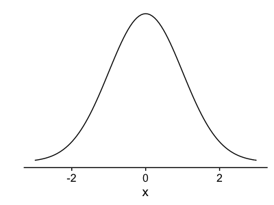
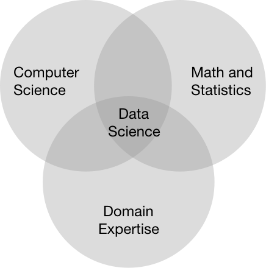
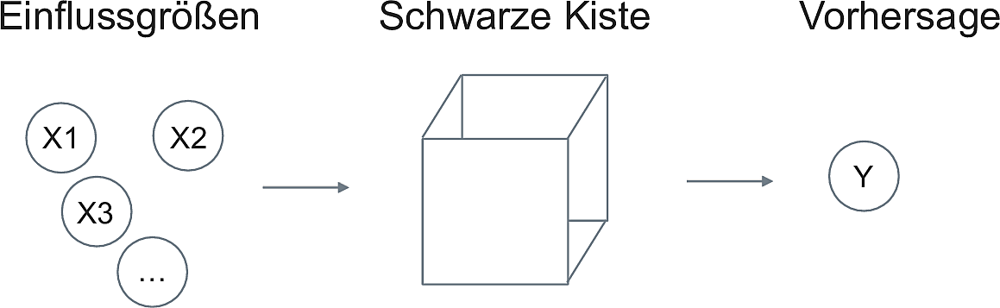
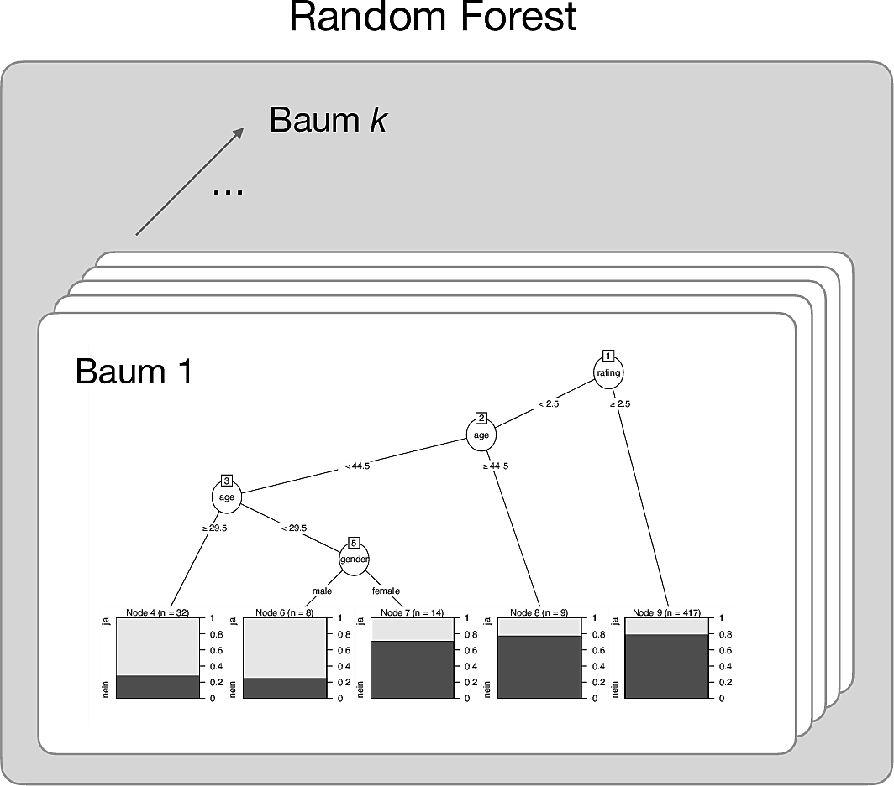
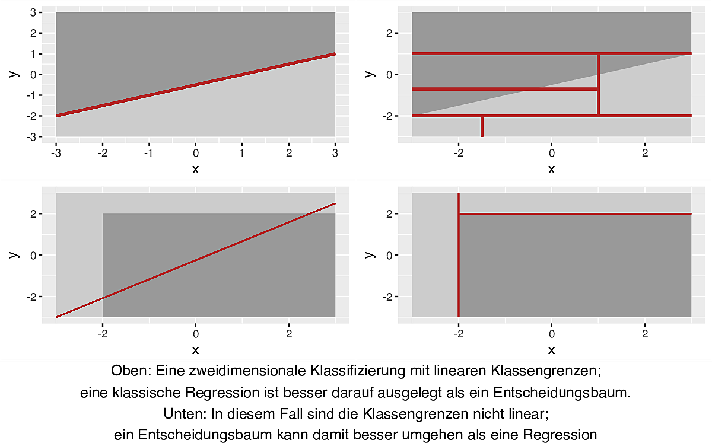
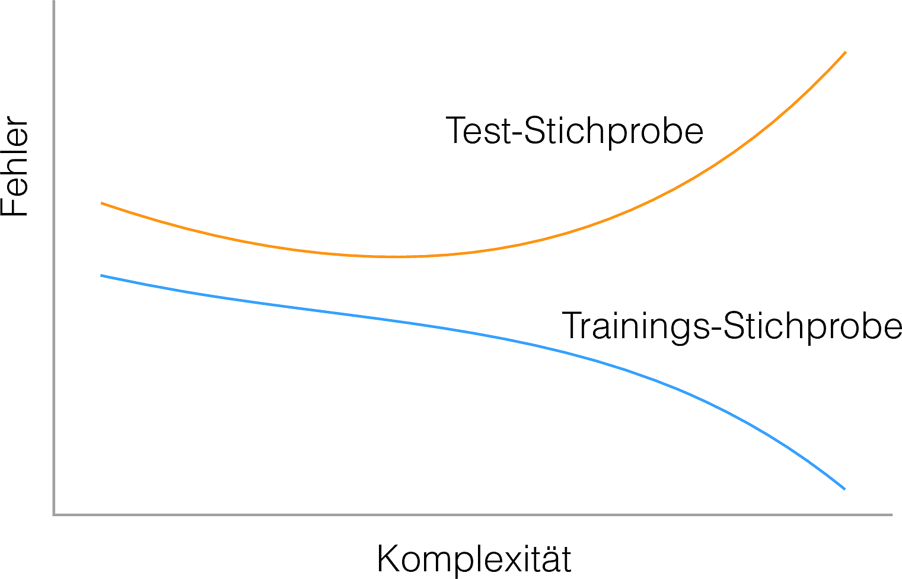

```{r xaringan-themer, include = FALSE}
library(xaringanthemer)

mono_light(
  base_color = "#23395b",
  header_font_google = google_font("Josefin Sans"),
  text_font_google   = google_font("Montserrat", "300", "300i"),
  code_font_google   = google_font("Droid Mono"),
  header_h1_font_size	= "50px",
  header_h2_font_size	= "30px",
  link_color = "ff9900"
)

```


```{r setup, include=FALSE}
options(htmltools.dir.version = FALSE)
```


```{r knitr-setup, echo = FALSE}


#knitr::opts_knit$set(
 # base.dir = base_dir,
  #base.url = base_url
#)

knitr::opts_chunk$set(
  collapse = TRUE,
  message = FALSE,
  warning = FALSE,
  cache = TRUE,
  out.width = "70%",
  fig.align = 'center',
  fig.width = 6,
  fig.asp =  0.618,  # 1 / phi
  fig.show = "hold",
  size = "tiny",
  dpi = 300,
  echo = FALSE #,
  #fig.path = fig_path
)
  

```

```{r libs}

library(gtrendsR)
library(tidyverse)
library(rprojroot)
library(knitr)
library(caret)
library(DT)
library(gridExtra)
library(sessioninfo)
library(plotly)
library(ggrepel)
```


```{r paths-setup}
proj_root <- find_root(as.root_criterion(is_rstudio_project))
base_url <- "/"
fig_path <- "imgs/"
diagram_path <- "/Users/sebastiansaueruser/Documents/RRRing/Diagrams/"
```


# Five Questions 

## .yellow[on the use of data science for business]

--
1. What's the meaning of *data science*, *machine learning*, and all these fancy terms?

--

2. What's the best model out there?

--

3. How do I know my model is doing good or bad?

--

4. Can you give me a cook book for data science?

--

5. ~~What are all the core concepts of the field~~?

---

class: middle bg-main1


# 1. What's the meaning of *data science*, *machine learning*, and all these fancy terms?


---


.pull-left[

# statistical models: 

## probability theory

.center-left[
```{r out.width="80%"}

```
]

]

.pull-right[
# machine learning:

## algorithmic models


.center-right[
```{r  out.width="80%"}
knitr::include_graphics("imgs/sorting_quicksort_anim.gif")
```
]

]


.footnote[Source: [Wikipedia](https://en.wikipedia.org/wiki/Algorithm) by en:User:RolandH]


---
class: bg-main1


# 'data science' is a popular term

Google Trends (2019-04-32) of data analysis jargon

```{r}
d_all <- read_csv("data/gtrends-2019-04-24.csv")
```


```{r p-gtrends}

p_gtrends <- d_all %>% 
  ggplot(aes(x = date, y = hits, color = keyword)) +
  geom_line() +
  geom_smooth(se = FALSE)

pg <- ggplotly(p_gtrends, width=800, height=500) %>%
                 animation_opts(200, redraw = FALSE, 
                 easing = "linear")
#pg

#htmltools::save_html(pg, file = "plotly_gtrends.html")

```


<iframe src="plotly_gtrends.html" width="800" height="450" scrolling="yes" seamless="seamless" frameBorder="0"> </iframe>


---


# What's data science?

Depends on whom you ask.


```{r out.width="50%"}

```


---


# Common theme


## Art and science of .yellow[learning from data]


$$Y=f(X)+\epsilon$$

$$\hat{Y}=\hat f(X)$$


```{r fig.asp = 0.4}
data(mtcars)


mtcars %>% 
  ggplot(aes(x = hp, y = mpg)) +
  geom_point() +
  geom_smooth(method = "lm", se = FALSE) +
  labs(x = "X",
       y = "Y") +
  theme(axis.line = element_blank(),
        axis.ticks = element_blank(),
        axis.text = element_blank())
```


---

class: bg-main1

# Machine learning: Feed the computer data, not rules


```{r}
include_graphics("https://christophm.github.io/interpretable-ml-book/images/programing-ml.png")
```


.footnote[Source: Molnar, C. (2019). Interpretable Machine Learning [ePub Book]. Morrisville, NC: Christoph Molnar.]


---

class: middle center inverse

# 2. What's the .yellow[best model] out there?


---


# A lot of models out there


.pull-left[


package [caret](https://topepo.github.io/caret/available-models.html)

```{r echo = TRUE}
getModelInfo() %>% 
  names() %>% 
  length()
```

]

.pull-right[


```{r }
getModelInfo() %>% 
  names() %>% 
  tibble::enframe() %>% 
  datatable(options = list(pageLength = 5))
```

]

---

class: middle 

# Wait, tell me which model is *best*


```{r out.width  = "50%" }
knitr::include_graphics("https://i.imgflip.com/269nqn.jpg")
```


---

# There is no single best model

.pull-left[


## Black box models

- Random forests
- Support vector machines
- Neural networks
- ...


## less interpretable

## more accurate (at times)

## less robust
]

.pull-right[

## "White box" models

- Linear regression
- k-nearest neighbours
- Decision trees
- ...

## more interpretable

## less accurate (at times)

## more robust


]

---


# Blackbox models  do not explain

```{r}

```


```{r out.width="50%"}
include_graphics("https://christophm.github.io/interpretable-ml-book/images/iml.png")
```


.footnote[Source: Molnar, C. (2019). Interpretable Machine Learning [ePub Book]. Morrisville, NC: Christoph Molnar.]

---


# Ensemble learners show a good track record


```{r out.width="50%"}

```


.footnote[Source: Sauer, S. (2018). Moderne Datenanalyse mit R: Daten einlesen, aufbereiten, visualisieren und modellieren. Wiesbaden: Springer.
]

---

# The fit of a model depends on eg the linearity of associations

```{r}

```


---

class: center middle inverse

# 3. How do I know my model is doing .yellow[good] or .yellow[bad]?

---


class: bg-main1


# Short answer: The less error, the better the model


```{r resids-plot, dpi = 300}

set.seed(42)  
N      <- 100
beta   <- 0.4
intercept <- 1


sim <- data_frame(
  x = rnorm(N),
  error1 = rnorm(N, mean = 0, sd = .5),
  error2 = rnorm(N, mean = 0, sd = 2),
  y1 = intercept + x*beta + error1,
  y2 = intercept + x*beta + error2,
  pred = 1 + x*beta
)


p_resid_1 <- ggplot(sim, aes(x, y1)) +
  geom_abline(intercept = intercept, slope = beta, colour = "red") +
  geom_point(colour = "#00998a") +
  geom_linerange(aes(ymin = y1, ymax = pred), colour = "grey40") +
  ylim(-6,+6) + labs(title = "A - small error")


p_resid2_2 <- ggplot(sim, aes(x, y2)) +
  geom_abline(intercept = intercept, slope = beta, colour = "red") +
  geom_point(colour = "#00998a") +
  geom_linerange(aes(ymin = y2, ymax = pred), colour = "grey40") +
  ylim(-6,+6) + labs(title = "B - large error")


grid.arrange(p_resid_1, p_resid2_2, ncol = 2)
```

---


# Wait ... 

## Which model do you prefer?


```{r overfitting-prep-4-plots}
x <- seq(from = 1, to = 10, by = .3)
y <- sin(x) + rnorm(n = length(x), mean = 0, sd = .3)

daten <- data_frame(x, y)

ggplot(daten) +
  aes(x = x, y = y) +
  coord_fixed(ratio = 5/1) +
  labs(y = "") +
  geom_point() +
  ggtitle("A") -> p1

ggplot(daten) +
  aes(x = x, y = y) +
  geom_point() +
  coord_fixed(ratio = 5/1) +
  labs(y = "") +
  geom_smooth(method = "lm", se = FALSE, color = "red") +
  ggtitle("B")-> p2


ggplot(daten) +
  aes(x = x, y = y) +
  geom_point() +
  coord_fixed(ratio = 5/1) +
  labs(y = "") +
  geom_line(color = "blue") +
  ggtitle("C") -> p3

ggplot(daten) +
  aes(x = x, y = y) +
  geom_point() +
  coord_fixed(ratio = 5/1) +
  labs(y = "") +
  stat_function(n = 99, fun = sin, color = "darkgreen") +
  ggtitle("D") -> p4
```


```{r overfitting-4-plots, dpi = 300}

grid.arrange(p1, p2, p3, p4, ncol = 4)

```


---


class: middle center inverse


# 4. Can you give me a .yellow[cook book] for data science?

---


# Step 1: Choose your model(s)


.pull-left[

## Classify stuff


```{r p-class-stat-bin-2d}

set.seed(42)
twoClassSim(n = 500, intercept = -5, linearVars = 10, noiseVars = 0,
  corrVars = 0, corrType = "AR1", corrValue = 0, mislabel = 0,
  ordinal = FALSE) -> sim_df

sim_df$Class_num <- ifelse(sim_df$Class ==
                           "Class1", 1, 0)


sim_df %>%
  filter(Linear01 > -2, Linear01 < 2) %>%
    filter(Linear02 > -2, Linear02 < 2) %>%
  ggplot() +
  aes(x = Linear01, y = Linear02, group = 1) +
  stat_summary_2d(aes(z = Class),
                  fun = function(z) names(which.max(table(z))),
                  bins = 3,
                  alpha = .5,
                  drop = TRUE) +
  geom_point(aes(color = Class, shape = Class), size = 3) +
annotate(geom = "point", x = 2, y = -1, shape = 8, size = 5) +
  labs(x = "x1", y = "x2",
       class = "Regen") +
  theme(legend.position = "none") +
  scale_color_manual(values = c("firebrick", "dodgerblue4")) +
  scale_fill_manual(values = c("grey50", "grey90"))


```

]

.pull-right[

## Estimate stuff


```{r}
data(mtcars)


mtcars %>% 
  ggplot(aes(x = hp, y = mpg)) +
  geom_point() +
  geom_smooth(method = "lm", se = FALSE) +
  labs(x = "X",
       y = "Y") +
  theme(axis.line = element_blank(),
        axis.ticks = element_blank(),
        axis.text = element_blank())
```


]

---

# Step 2: Build model fed on historical data


```{r plot-bias-variance, echo = FALSE, dpi = 300}
poly_degree = 15
df <- tibble(x = seq(from = 1, to = 10, by = .3),
                 y = sin(x) + rnorm(n = length(x), mean = 0, sd = .3))

df %>%
  mutate(binned = cut(.$x, breaks = c(-Inf, 5.5, +Inf))) %>%
  group_by(binned) %>%
  mutate(y_group_md = median(y)) -> df


p1 <- ggplot(df) +
  aes(x = x, y = y) +
  geom_point() +
  geom_smooth(method = "lm", formula = y ~ poly(x, poly_degree), se = FALSE)


p2 <-  ggplot(df) +
  aes(x = x) +
  geom_point(aes(y = y)) +
  geom_line(aes(y = y_group_md, group = binned), color = "firebrick")


```


.pull-left[

## Overfitting


```{r}
p1
```

]

.pull-right[

## Underfitting

```{r}
p2
```

]

---


# Step 3: Predict the future

## Run the model on *new* data


```{r}

```


---

# Step 4: Evaluate the model


```{r}
grid.arrange(p_resid_1, p_resid2_2, ncol = 2)
```


---

# Here's one way how to get going

```{r}
knitr::include_graphics("https://www.williamrchase.com/slides/slide_img/throw_into_pool.gif")
```

.footnote2[Source: <https://www.williamrchase.com/slides/slide_img/throw_into_pool.gif>]
---


# Some literature explaining core concepts of data science


Grolemund, G., & Wickham, H. (2016). R for Data Science. Retrieved from https://books.google.de/books?id=aZRYrgEACAAJ

James, G., Witten, D., Hastie, T., & Tibshirani, R. (2013). An introduction to statistical learning (Vol. 6). New York City, NY: Springer.

Sauer, S. (2019). Moderne Datenanalyse mit R: Daten einlesen, aufbereiten, visualisieren und modellieren (1. Auflage 2019). Wiesbaden: Springer.


---


class: center middle

Sebastian Sauer
<br>
<br>

#### `r icon::fa("github", size = 1)` [sebastiansauer](https://github.com/sebastiansauer)
#### `r icon::fa("link", size = 1)` <https://data-se.netlify.com/>
#### `r icon::fa("envelope", size = 1)` sebastian.sauer@data-divers.com
#### `r icon::fa("twitter", size = 1)` [sauer_sebastian](https://twitter.com/sauer_sebastian)

 
#### `r icon::fa("file", size = 1)` Get slides here:  https://data-se.netlify.com/slides/afd_ecda2019/afd-modeling-ECDA-2019.pdf


CC-BY


---

# Reproducibility

```{r}
pckgs <- package_info()

pckgs <- unite(pckgs, "pckg_v", c("package", "loadedversion") )
```


- Versions of employed software as of `r lubridate::today()`, running this OS: `r sessioninfo::os_name()`.
- Built with [R](https://www.r-project.org/), `r sessioninfo::platform_info()$version`, [RStudio](https://www.rstudio.com/) 1.2.1335, [xaringan](https://github.com/yihui/xaringan), on the shoulders of giants
- Source Code: XXX
- Icons are from [FontAwesome](https://fontawesome.com/), licenced under CC-BY-4 ([details](https://fontawesome.com/license/free))
- R-Packages used: .small[`r pckgs$pckg_v`]
- Last update `r lubridate::today()`