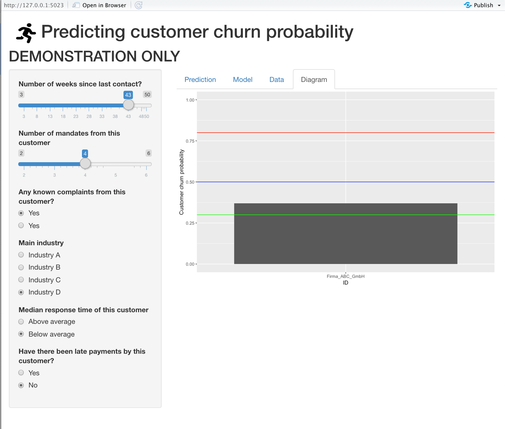
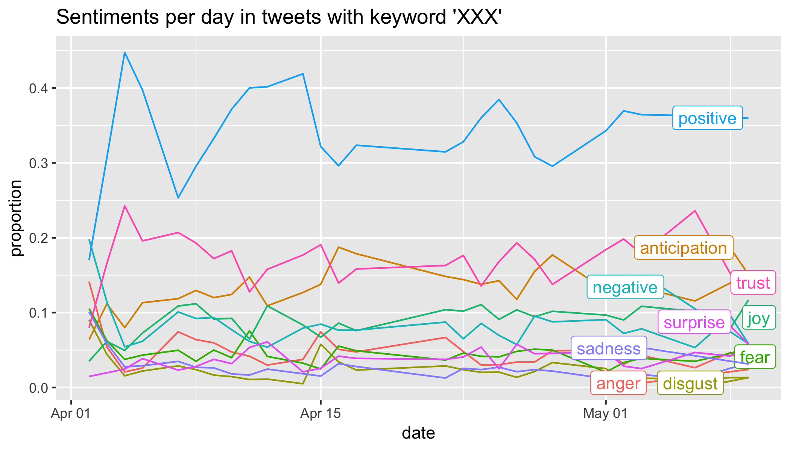
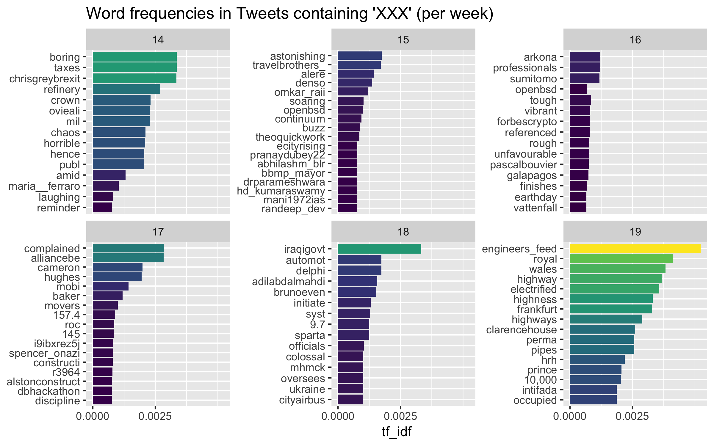

```{r xaringan-themer, include = FALSE}
library(xaringanthemer)

mono_light(
  base_color = "#23395b",
  header_font_google = google_font("Josefin Sans"),
  text_font_google   = google_font("Montserrat", "300", "300i"),
  code_font_google   = google_font("Droid Mono"),
  header_h1_font_size	= "50px",
  header_h2_font_size	= "30px",
  link_color = "ff9900"
)

# mono_light(base_color = "#23395b")
```


```{r setup, include=FALSE}
options(htmltools.dir.version = FALSE)
```


```{r knitr-setup, echo = FALSE}


#knitr::opts_knit$set(
 # base.dir = base_dir,
  #base.url = base_url
#)

knitr::opts_chunk$set(
  collapse = TRUE,
  message = FALSE,
  warning = FALSE,
  cache = TRUE,
  out.width = "70%",
  fig.align = 'center',
  fig.width = 6,
  fig.asp =  0.618,  # 1 / phi
  fig.show = "hold",
  size = "tiny",
  dpi = 300,
  echo = FALSE #,
  #fig.path = fig_path
)
  

```

```{r libs}

library(gtrendsR)
library(tidyverse)
library(rprojroot)
library(knitr)
library(caret)
library(DT)
library(gridExtra)
```


```{r paths-setup}
proj_root <- find_root(as.root_criterion(is_rstudio_project))
base_url <- "/"
fig_path <- "imgs/"
diagram_path <- "/Users/sebastiansaueruser/Documents/RRRing/Diagrams/"
```


# Overview

.center2[
1. **Employee retention**: Predict employee propensity to leave the company 

2. **Predictive competition**: Compare the predictive performance of traditional/novel models 

3. **Social Listening**: Quantify brand opinion (and related emotions) 

4. **Objective organization climate**: Build text-based model for organization climate 
]

---

class: center middle inverse

# 1.  Employee retention: Predict employee propensity to leave the company 


---


# Input: Employee's data, output: leave propensity

`r icon::fa("exclamation-circle", size = 1)` data privacy

```{r out.width="70%"}
knitr::include_graphics("imgs/log-reg-intuition.png")
```


---

# Industry example: employee retention at IBM

IBM artificial intelligence can predict with 95% accuracy which workers are about to quit their jobs. See this [case study](https://towardsdatascience.com/building-an-employee-churn-model-in-python-to-develop-a-strategic-retention-plan-57d5bd882c2d).


.pull-left[

```{r out.width='90%', fig.show='hold'}
knitr::include_graphics("https://cdn-images-1.medium.com/max/1600/1*tm31oVS7Mc2mP78yIa_lqA.png")
```
]

.pull-right[

```{r out.width='90%', fig.show='hold'}
knitr::include_graphics("https://cdn-images-1.medium.com/max/1600/1*gi7rrpqphWz9cfpAkK1LZQ.png")
```

]


.footnote[Source: [CNBC](https://www.cnbc.com/2019/04/03/ibm-ai-can-predict-with-95-percent-accuracy-which-employees-will-quit.html), [TowardsDataScience](https://towardsdatascience.com/building-an-employee-churn-model-in-python-to-develop-a-strategic-retention-plan-57d5bd882c2d)]
---


# See live app


```{r}

```


---


class: center middle inverse


# 2. Predictive competition: Compare the predictive performance of traditional/novel models 


---


# Case study -- Predicting therapy success (1/2)


```{r}

```


.footnote[Lenhard, F., Sauer, S., Andersson, E., Månsson, K. N., Mataix-Cols, D., Rück, C., & Serlachius, E. (2018). Prediction of outcome in internet-delivered cognitive behaviour therapy for paediatric obsessive-compulsive disorder: A machine learning approach. International Journal of Methods in Psychiatric Research, 27(1), e1576. https://doi.org/10.1002/mpr.1576]


---

# Case study -- Predicting therapy success (2/2)


```{r}
d <- read_delim("data/Lenhard.csv", 
    ";", escape_double = FALSE, locale = locale(), 
    trim_ws = TRUE) %>% 
  mutate(best_model = Accuracy == max(Accuracy))


d %>% 
  ggplot(aes(y = reorder(Method, Accuracy))) +
  geom_errorbarh(aes(xmin = `Low-95`, xmax = `Up-95`),
                 height = .1, color = "grey60") +
  geom_point(aes(x = Accuracy, color = best_model),
             size = 5) +
  labs(y = "Model",
       caption = "Note. Bars denote 95% CI.") +
  theme(legend.position = "bottom") +
  scale_color_viridis_d()

```


---

class: center middle inverse

# Social Listening: Quantify brand opinion (and related emotions) 

---


# Emotions in tweets with keyword 'XXX'


```{r}

```


.footnote[XXX: name of a brand, here anonymized]

---

# Word frequencies in tweets containing 'XXX'


```{r out.width = "100%"}

```


.footnote[XXX: name of a brand, here anonymized]

---

class: center middle inverse


# 4. Objective organization climate: Build text-based model for organization climate 


---


# Calibrate words to measure organizational climate


```{r}
knitr::include_graphics("imgs/calibrate-text.png")
```

---


class: center middle

Sebastian Sauer
<br>
<br>

#### `r icon::fa("github", size = 1)` [sebastiansauer](https://github.com/sebastiansauer)
#### `r icon::fa("link", size = 1)` <https://data-se.netlify.com/>
#### `r icon::fa("envelope", size = 1)` sebastian.sauer@data-divers.com
#### `r icon::fa("twitter", size = 1)` [sauer_sebastian](https://twitter.com/sauer_sebastian)

 
CC-BY


---


# Reproducibility

```{r}
pckgs <- sessioninfo::package_info()

pckgs <- unite(pckgs, "pckg_v", c("package", "loadedversion") )
```


- Versions of employed software as of `r lubridate::today()`, running this OS: `r sessioninfo::os_name()`.
- Built with [R](https://www.r-project.org/), `r sessioninfo::platform_info()$version`, [RStudio](https://www.rstudio.com/) 1.2.1335, [xaringan](https://github.com/yihui/xaringan), on the shoulders of giants
- Source Code: XXX
- Icons are from [FontAwesome](https://fontawesome.com/), licenced under CC-BY-4 ([details](https://fontawesome.com/license/free))
- R-Packages used: .small[`r pckgs$pckg_v`]
- Last update `r lubridate::today()`