```{r setup, include=FALSE}
options(htmltools.dir.version = FALSE)

knitr::opts_chunk$set(
  comment = "#>",
  collapse = TRUE,
  message = FALSE,
  warning = FALSE,
  error = TRUE,
  cache = TRUE,
  echo = FALSE,
  out.width = "50%",
  fig.align = 'center',
  fig.width = 6,
  fig.asp =  0.618,  # 1 / phi
  fig.show = "hold",
  size = "tiny"
)
```


```{r libs}
library(tidyverse)
library(knitr)
library(pander)
library(kableExtra)
```


class: center, middle, inverse


# Introduction

---

class: left, top

# Research question

- How populist are (chatter) present German politicians?

- Do tweets provide a useful measure for populism?


---


# Popper's theory of the tribal community

<br>
<br>
<br>
<br>
*tribal community*  `r icon::fa("arrow-right", size = 1)`  *person centered community*


.footnote[Source: Popper, Karl. 1972. Die Offene Gesellschaft und ihre Feinde. Band 1. Bern: Francke UTB.]

---


# Populism as the desire to go back to the tribal community


- Losing (having lost) the security of the tribal society hurts

- The modern person centered (individualistic) society is marked by..
    - insecurity
    - ambiguity
    - abundance of possibility
    - accountability
    
- Feeling of "being lost" and "drifting" emerges

- Populist politicians as the advocates of the regression to the tribal community


---

# Drivers of populim


- Populism is fueled by ...

    - problems and crisis of modern live 
    
    - change, progress, instability of the society


---


class: center, middle, inverse


# Methods

---

class: top, left

# Data source: Tweets


- Communication styles of politicians (and parties) gathered via tweets

- Tweets as data source helps...

    - processing large data volumes
    - quite objective analysis criteria
    - reproducibility
    - replicability

---

# Populism score


Unweighted median (z-values) of 8 indicators

```{r echo = FALSE}
pop_vars_de <- c(word_length_md_comp_z = "word shortness",
                 neg_words_ratio_z = "ratio of negative/positive words",
                 neg_prop_z = "proportion of negative words",
                 emo_words_prop_z =  "proportion of emotional words",
                 emo_score_neg_z =  "negative emotion score",
                 emo_abs_score_z = "overall emotion scoree",
                 cap_prop_z = "proportion of CAPITAL LETTERS",
                 adj_adv_quote_z =  "ratio of adjectives to adverbs")

as_tibble(pop_vars_de) %>% 
  rownames_to_column() %>% 
  select(Indicator = value) %>% 
  kable() %>%
  kable_styling()
```


---


# Hypothesis
<br>
<br>
<br>
<br>
- Order of populism scores per party:

    - Trump > AfD > else
    
    
.footnote[preregistered: <https://osf.io/bwszu>]

---


# Data

- $d \approx 400k$ tweets from German politicians

- $t \approx 32k$ Tweets by Donald Trump

- $w \approx 6.3 Mio$ words

- $k = 200$ Twitter accounts

- $p = 8$ political parties 

    - AfD, CDU, CSU, FDP, Grüne, Linke, SPD, (fraktionslos), Trump/GOP
    
- Data were collected in August 2017


---

# data aggregation

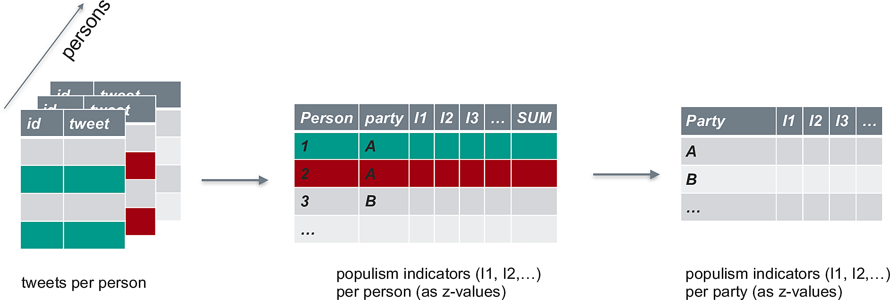


---

# Analysis

1. Compute all 8 populism indicators per politician

2. Recode (if necessary) and compute z-values per indicator and per politician

2. Compute overall populism score (median) per politician

3. Computer overall populism score (median) per party

---

# Accounts of politicians

- [List](https://twitter.com/dw_politics/lists/german-politicians/members) "German Politicians" of [Deutsche Welle](http://www.dw.com/de/unternehmen/profil/s-30626)

- Twitter accounts of [Bundesvorstands der AfD](https://www.afd.de/partei/bundesvorstand/)

- Twitter accounts of [Präsidiuums der FDP](https://www.fdp.de/seite/praesidium)

- Markus Söder


.footnote[as of August 2017]

---


# Tweets timeline


```{r out.width = "70%"}
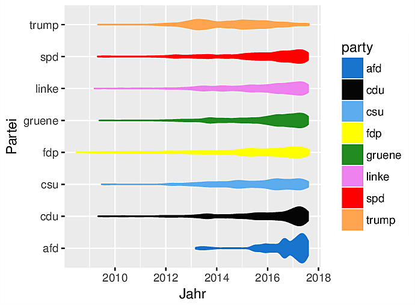
```


---


class: center, middle, inverse

# results


---

class: top, left


# SPD contributes the largest share of accounts


```{r out.width = "60%"}
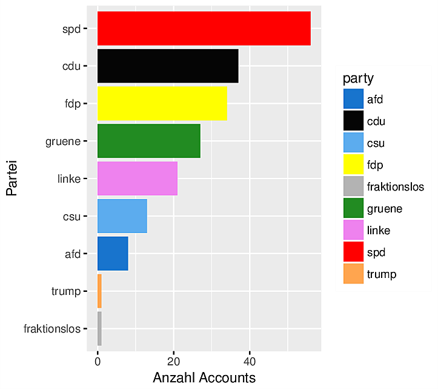
```


---

# SPD contributes the largest share of tweets


```{r out.width="70%"}
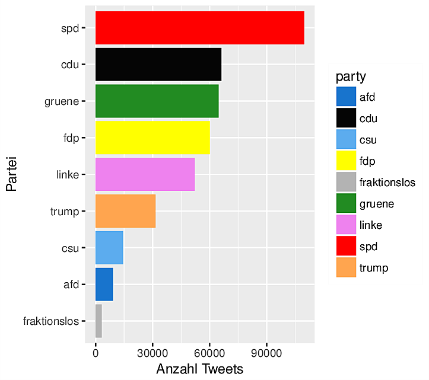
```


---

# Trump tweets the most 

So great, great genes


```{r out.width="70%"}
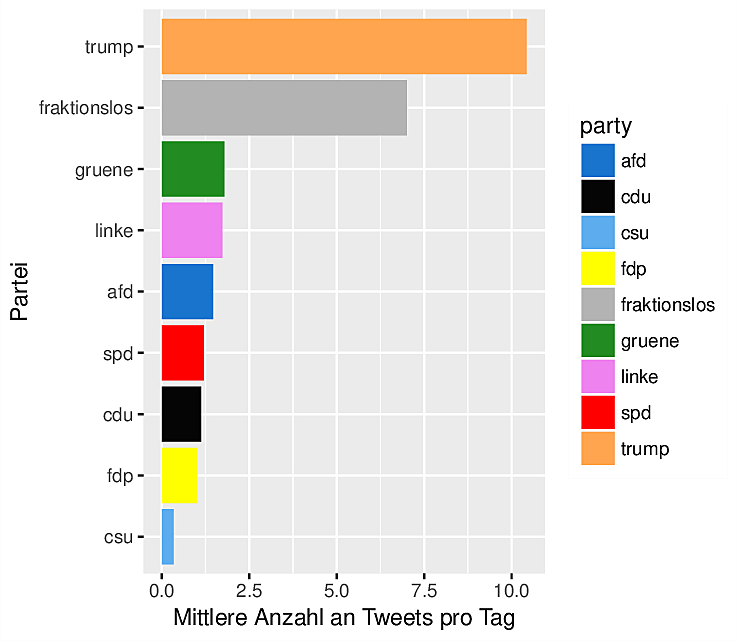
```


---


# Grüne: A lot of tweets, CSU: relatively silent

```{r}
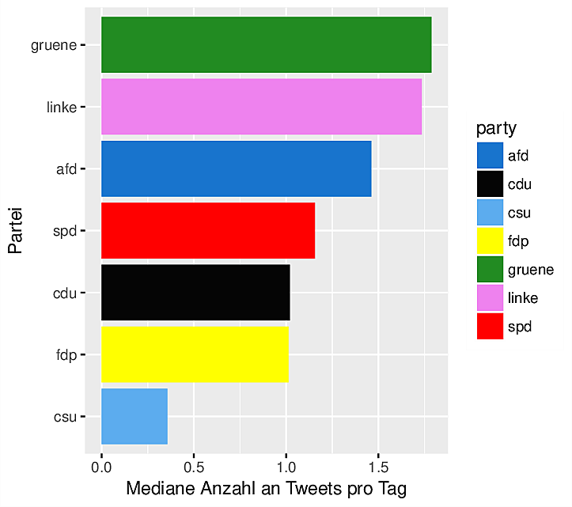
```


---


# Trumps populism score is the greatest 

(great genes)


```{r out.width = "70%"}
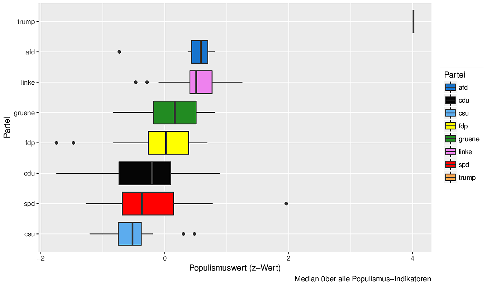
```


---

# Union/SPD are *least* populist


```{r out.width = "70%"}
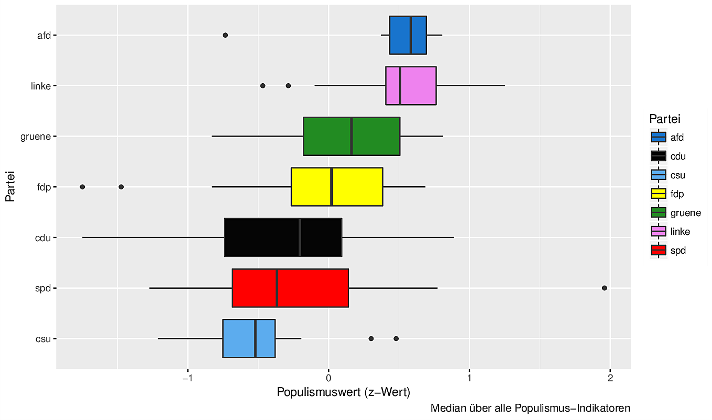
```

.footnote[Trump excluded from this and subsequent analyses]

---

# AfD and Linke: similar populism pattern


```{r out.width = "100%"}
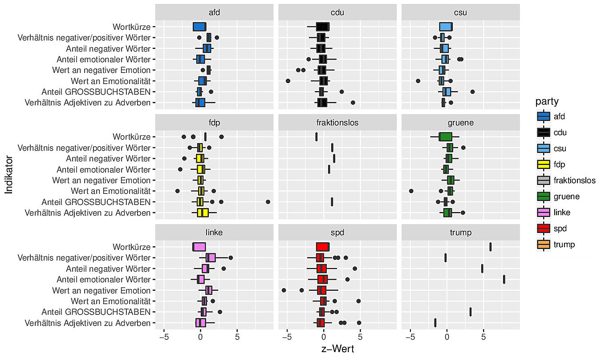
```


---


# "Top 10 populists" - many from the Linke

cum *large* grano salis


```{r out.width = "70%"}
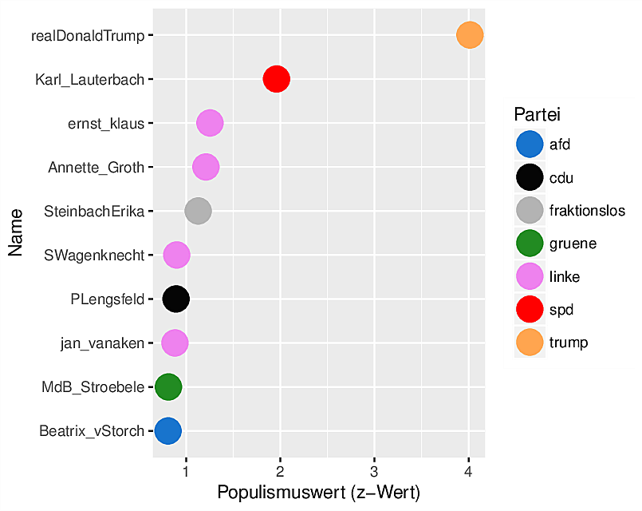
```


---


# Closeup view of "top-1 populist"

cum *large* grano salis

```{r out.width = "70%"}
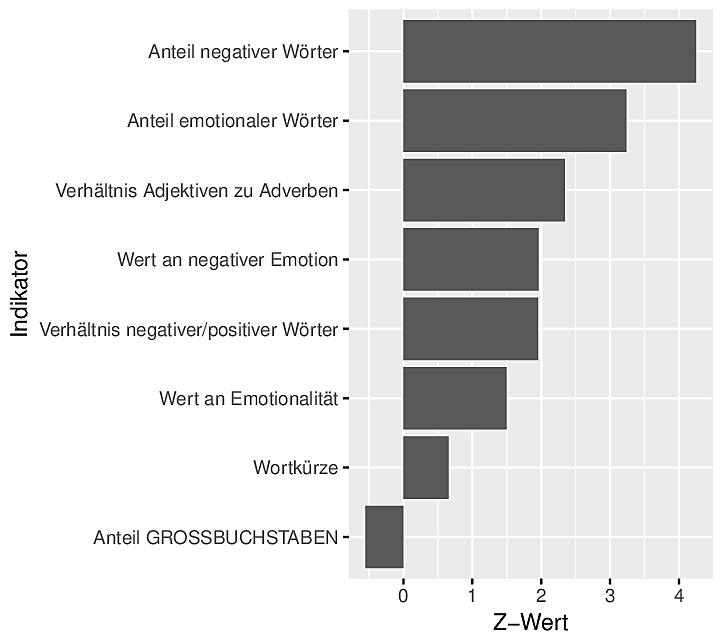
```


---

# Sample tweets of "top-1 populist"

```{r results = "asis"}
load("/Users/sebastiansaueruser/Documents/research/polit/data_polit_twitter/top_1_pop_account_sample_tweets.Rdata")

top_1_pop_account_sample_tweets %>% 
  as_tibble %>% 
  rename(Tweet = value) %>% 
  mutate(Nr = 1:n()) %>% 
  select(Nr, Tweet) %>% 
  mutate(Tweet = paste0("\'",Tweet, "\\'")) %>% 
  slice(1:4) %>% 
  pandoc.table(split.cells = 70)
```

---

# "Horde words"


```{r}
horde <- c("Stamm", "Bund", "Deutsch", "deutsch", "Deutschland", "Volk", "Gemeinschaft", "Schöpfung", "Ehre", "Respekt", "Held", "Heroe", "heroisch", "heldenhaft", "ehrenvoll", "völkisch", "Volksgemeinschaft", "Kampf", "Sieg", "Vernichtung", "Blut", "Boden", "ausländisch", "Ausländer", "Krieger", "Krieg", "Tradition", "Überlieferung", "heilig", "heilige", "Gnade", "ewig", "Ahnung", "Erlösung", "erlöst", "erlösen", "Verdammung", "Fluch", "verdammt", "verflucht", "verdammen", "verfluchen", "Verheißung", "Anmaßung", "anmaßend", "anmaßen", "Böse", "Verachtung", "Verlangen", "Heimat")

horde

```


.footnote[source: https://osf.io/b6ge7/]

---

# "Horde score"

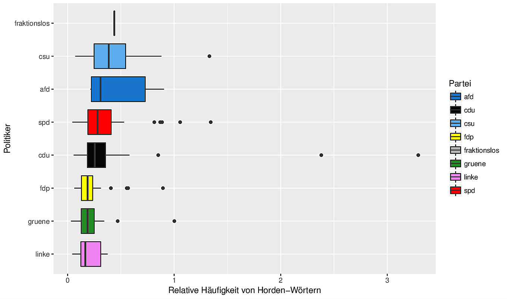


---

# AfD and the Union parties use relative often "deutsch*" words


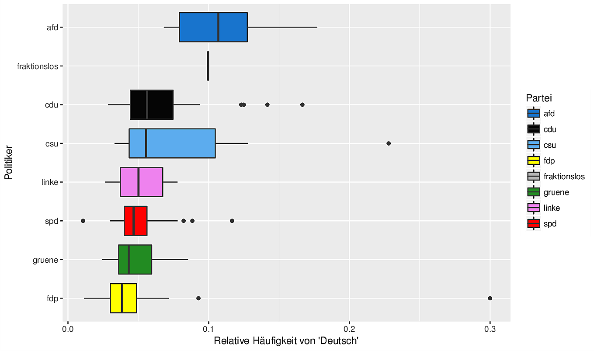

---

class: center, middle, inverse

# Discussion


---

class: top, left

# Strengths


- Interesting, thought provoking results

- Relatively little used method

- quite objective

- automated processing


---

# Room for improvement

- Indicators were chosen with some degree of subjectivity

- More and different analyses are warranted
  - Modeling
  - Effect sizes
  - statistical uncertainty
  
- Was the sample representative for German politician chatter?

- Association with external criteria is still unknown


---


class: middle, center, inverse

# Thank you

Sebastian Sauer


#### `r icon::fa("github", size = 1)` [sebastiansauer](https://github.com/sebastiansauer)
#### `r icon::fa("link", size = 1)` <https://data-se.netlify.com/>
#### `r icon::fa("envelope", size = 1)` ssauer@posteo.de
#### `r icon::fa("linkedin-in", size = 1)` [Sebastian Sauer](https://www.linkedin.com/in/dr-sebastian-sauer-4791762)
 
#### `r icon::fa("file", size = 1)` Get slides here: 

<http://data-se.netlify.com/slides/afd_dgps2018/afd_dgps2018.html#1>
  
CC-BY

---


class: middle, center, inverse


# Backup

---

class: top, left

# Forschungsfragen - Detail

- (Wie) unterscheiden sich deutsche Parteien in ihrer Neigung zum Populismus (in ihren Tweets)?

- Tweetet Trump am populistischsten?

---

# Poppers Theorie der "Urhorde" als Rahmen für Populismus (Details)

- Popper  Entwicklung von *Stammesgesellschaft* zur *Individuumsgesellschaft*

- **Stammesgesellschaft**: Heldenepos, Heroen, Führerpersönlichkeiten, Ehre, Gewissheit über richtig/falsch, herrschende Kaste, zementierte Gesellschaftsstrukturen, "unser Boden", "unsere Blutsbande", "unser Stamm", Individuum als Teil des Stammes, Entwicklung kaum möglich, klare Regeln, klare Strafen, "wir gegen die", Stärke als Wert, Kampfesmentalität, totalitär, starke Kohäsionskräfte, Feinde sind nötig und werden gefunden

- **Individuumsgesellschaft**: Hinterfragen, Kritisieren, Ungewissheit, Zweifel, "Dahintreiben", Individuum als Individuum, schnelle Entwicklung möglich, Idee der Mündigkeit und Eigenverantwortlichkeit, Einsamkeit, humane Gesellschaft möglich

---

# Populismus heute - im Aufwind?

- Zu Zeiten von *Umbrüchen* steigt das Leiden an der Individuumsgesellschaft; Stammesgesellschaft wird attraktiver

- Zu Zeiten des *Vormarschs der Individuumsgesellschaft* steigt das Leiden an ihr; Stammesgesellschaft wird attraktiver

- Zur Zeiten von *Krisen* steigt das Leiden an der Ungewissheit; der Wunsch nach Gewissheit steigt, die Stammesgesellschaft wird attraktiver

