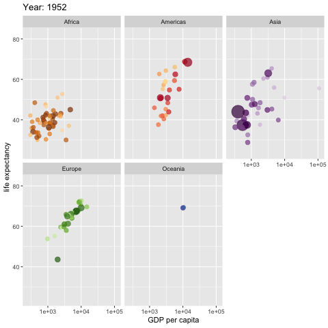
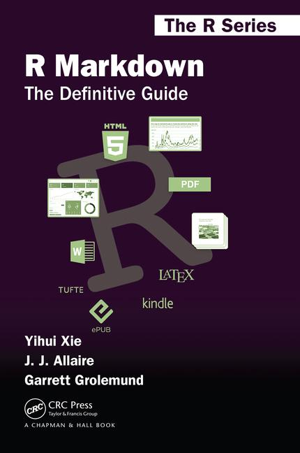

```{r xaringan-themer, include = FALSE}
library(xaringanthemer)

mono_light(
  base_color = "#23395b",
  header_font_google = google_font("Josefin Sans"),
  text_font_google   = google_font("Montserrat", "300", "300i"),
  code_font_google   = google_font("Droid Mono"),
  header_h1_font_size	= "50px",
  header_h2_font_size	= "30px",
  link_color = "ff9900"
)

```


```{r setup, include=FALSE}
options(htmltools.dir.version = FALSE)
```


```{r knitr-setup, echo = FALSE}


#knitr::opts_knit$set(
 # base.dir = base_dir,
  #base.url = base_url
#)

knitr::opts_chunk$set(
  collapse = TRUE,
  message = FALSE,
  warning = FALSE,
  cache = TRUE,
  out.width = "70%",
  fig.align = 'center',
  fig.width = 6,
  fig.asp =  0.618,  # 1 / phi
  fig.show = "hold",
  size = "tiny",
  dpi = 300,
  echo = FALSE #,
  #fig.path = fig_path
)
  

```

```{r libs}
library(tidyverse)
library(knitr)
library(DT)
library(gridExtra)
library(sessioninfo)
library(plotly)
library(here)
library(DiagrammeR)
library(DiagrammeRsvg)
```


```{r paths-setup}
proj_root <- here::here()
base_url <- "/"
fig_path <- "/imgs/"
diagram_path <- "/Users/sebastiansaueruser/Documents/RRRing/Diagrams/"
```


```{r, load_refs, include=FALSE, cache=FALSE}
library(RefManageR)
BibOptions(check.entries = FALSE,
           bib.style = "authoryear",
           cite.style = "alphabetic",
           style = "markdown",
           hyperlink = FALSE,
           dashed = FALSE)
myBib <- ReadBib("./bib.bib", check = FALSE)
```


## Gliederung


1. Worum geht es hier eigentlich?

2. Markdown

3. Git

4. Fazit


---
class: middle bg-main1

# 1. Worum geht es hier eigentlich?


---

# Was ist das Wesensmerkmal der Wissenschaft?


.pull-left[


```{r out.width="60%"}
knitr::include_graphics("https://upload.wikimedia.org/wikipedia/commons/4/43/Immanuel_Kant_%28painted_portrait%29.jpg")
```

]


.pull-right[

>   "Habe den Mut, dich deines eigenen Verstandes zu bedienen".
]


~~Das~~ Ein Wesensmerkmal der Wissenschaft ist *Transparenz*.

Wissenschaft heißt *zeigen*, nicht *glauben*.

---


# Transparenz ist notwendig für *Reproduzierbarkeit*


>   reproducibility refers to the ability of a researcher to duplicate the results of a prior study using the same materials as were used by the original investigator. `r Citet(myBib, "goodman_what_2016")`.


Ein Forschungsbericht sollte wie ein *Kochrezept* sein: Alle Informationen sind enthalten, um das Gericht jeweils (ausreichend) gleich nachzukochen.


`r emo::ji("zap")` Ist ein Forschungsergebnis nicht reproduzierbar, sind wir zum (Nicht-)Glauben gezwungen. Das ist keine Wissenschaft.

*Open Science*: Open data, open materials, open code, literate programming ...


---


# Aber haben wir ein Problem mit geringer Reproduzierbarkeit?


```{r out.height="40%"}
knitr::include_graphics("https://www.nature.com/news/polopoly_fs/7.36716.1469695923!/image/reproducibility-graphic-online1.jpeg_gen/derivatives/landscape_630/reproducibility-graphic-online1.jpeg" ) 


```

`r Citep(myBib, "baker_1500_2016")`


Ja.


---


# Was sind die Ursachen geringer Reproduzierbark?


- *Fehlende Informationen*
- Fehlende Nachvollziehbarkeit
- Copy-Paste-Fehler
- Keine Syntax
- Keine frei nutzbaren Messinstrumente
- Software-Updates
- Verwendete Software nicht mehr verfügbar
- Verwendete Werkzeuge zu teuer
- ...


---


# Wäre es nicht schön ... 1/2


.pull-left[
>   "Die mittlere Reaktionszeit betrug **\[hier automatisch das Ergebnis der Berechnung einfügen\]** Sekunden."
]


.pull-right[
<a href="https://imgflip.com/i/39nb0w"></a>
]


---

# Wäre es nicht schön ... 2/2


.pull-left[

Bla bla bla ...

```
x1 = rechne(Input_Data)
x2 = rechne_mehr(x1)
x3 = irgendwas(x2)
x4 = wildes_zeugs(x3)
```

Die mittlere Reaktionszeit betrug `x4` Sekunden.

Bla bla bla ...
]


.pull-right[

Bla bla bla ...

Die mittlere Reaktionszeit betrug 3.141 Sekunden.

Bla bla bla ...

]


---


# Es geht: Z.B. mit Markdown `r icon::ii("social-markdown")` 


.pull-left[
```{markdown, eval = FALSE, echo = TRUE}

# Ich bin ein Titel.

Ich bin ein Satz.

Eine Liste beginnt.
  
- ja
- nein
- vielleicht
  
Eine nummerierte Liste:
  
1. 3.4145
2. 2.7182
3. 42

```
]


.pull-right[
# Ich bin ein Titel.
Ich bin ein Satz.

Eine Liste beginnt.
  
- ja
- nein
- vielleicht
  
Eine nummerierte Liste:

1. 3.4145
2. 2.7182
3. 42


]


---


# Markdown ist fast WYSIWYG


.pull-left[
```{markdown, eval = FALSE, echo = TRUE}

__fett__, 

_kursiv_, 

~~durchgestrichen~~
```
]


.pull-right[

**fett**,

*kursiv*,

~~durchgestrichen~~


]


---


# Noch mehr Markdown


.pull-left[
```{markdown, eval = FALSE, echo = TRUE}
# Title level 1


## Title level 2


Link:  [my blog](https://data-se.netlify.com/)

Citation: [@Xie2018]

Image: 


```
]


.pull_right[
# Title level 1
## Title level 2

Link:  [my blog](https://data-se.netlify.com/).

Citation: (Xie & Allaire, 2018)

Image: 

]

---


# Markdown ist eine Markup-Sprache


*Markup-Sprachen* nutzen Auszeichungen für Textformatierungen.

Bekannte Beispiele:

- HTML
- LaTeX
- XML
- Word (ist XML)
- Powerpoint (ist XML)
- ...


Markdown ist eine sehr einfache Markup-Sprache (daher "Mark-Down").

---

# Markdown is nicht Latex 

```{tex, eval = FALSE, echo = TRUE}
\makeatletter
\newenvironment{kframe}{%
\medskip{}
\setlength{\fboxsep}{.8em}
 \def\at@end@of@kframe{}%
 \ifinner\ifhmode%
  \def\at@end@of@kframe{\end{minipage}}%
  \begin{minipage}{\columnwidth}%
 \fi\fi%
 \def\FrameCommand##1{\hskip\@totalleftmargin \hskip-\fboxsep
 \colorbox{shadecolor}{##1}\hskip-\fboxsep
     % There is no \\@totalrightmargin, so:
     \hskip-\linewidth \hskip-\@totalleftmargin \hskip\columnwidth}%
 {\par\unskip\endMakeFramed%
 \at@end@of@kframe}
\makeatother
```


Zum Glück.
---


# Ich, als ich neulich kurz was in meiner Latex-Präambel ändern wollte

.center[

]

---

# Markdown als *lingua franca* der Markup-Sprachen

Mit dem Programm [Pandoc](http://pandoc.org/MANUAL.html) lassen sich Markup-Sprachen ineinander übersetzen.

```{r pandoc-model, eval = FALSE, echo = FALSE, fig.align='center', fig.width = 8, fig.asp =  .81, out.width = "100%"}
p_pandoc <- grViz("
digraph pandoc {

  graph [overlap = true, fontsize = 10]

  node [shape = box,
        fontname = Helvetica]
  Markdown; PDF; HTML; DOCX; PPTX; etc

  Markdown -> PDF
  Markdown -> HTML
  Markdown -> DOCX
  Markdown -> PPTX
  Markdown -> etc

}
")


p_svg <- export_svg(p_pandoc)

write(p_svg, file = "imgs/p_pandoc.svg")
#dput(p_svg, file = "img/p_pathmodel.svg")
```


```{r}

```


---

# Kurz mal Pause ...


.pull-left[

Wir haben uns *nicht* mit Formatierung des Textes beschäftigt, nur mit seinem Inhalt.

*Jemand* (etwas) hat uns die Formatierung abgenommen.

]


.pull-right[

<a href="https://imgflip.com/i/39nh45"></a>
]


---

class: inverse

# `r emo::ji("weight_lifting_man")` Übung: Erstellen Sie ein Markdown-Dokument in RStudio!


1. In RStudio: File > New File > R Markdown > ... OK
2. Löschen Sie alles, was in der Datei schon steht
3. Schreiben Sie ein paar Zeilen in Markdown
4. Klicken Sie auf "Knit" (engl. für stricken) oder drücken Sie Strg-Shift-K


[Erklärvideo](https://youtu.be/XWmOF1arO3I)

---


# R + Markdown = RMarkdown


.pull-left[

]


.pull-right[

```{r echo = FALSE, comment = "", eval = TRUE}
cat(htmltools::includeText("rmd1.txt")) 

```


]

---


class: inverse

# `r emo::ji("weight_lifting_man")` Übung: Erstellen Sie ein RMarkdown-Dokument in RStudio!


Sie können mit diesem Code beginnen und dann nach eigenem Belieben anpassen:


```{r echo = FALSE, comment = "", eval = TRUE}
cat(htmltools::includeText("rmd1.txt"))

```


---

# Was sind die Metadaten eines Dokuments?


Metadaten sind Daten über Daten (hier: über ein Dokument), z.B.


--
- Titel

- Autor

- Papiergröße

- ...


---


# Metadaten in RMarkdown


Metadaten werden in RMarkdown in einem Bereich, der mit `---` vorne und hinten abgegrenzt ist, definiert:

```
--- 
title: "Das ist der Titel des Dokuments"
author: "Hier steht der Name des Authors"
date: `r Sys.Date()`  # Man kann auch R-Inline-Befehle einflechten
--- 
  
```


Das Format ist i.d.R. `Variable = Wert`.

Genauer gesagt wird das ([YAML](https://en.wikipedia.org/wiki/YAML))-Format verwendet.

Meist steht dieser Bereich zu Beginn des Dokuments (daher "YAML-Header").


---

class: inverse

# `r emo::ji("weight_lifting_man")` Übung: Fügen Sie Ihrem Rmd-Dokument einen YAML-Header hinzu!


```{r echo = FALSE, comment = "", eval = TRUE}
cat(htmltools::includeText("rmd2.txt")) 

```


---


# RMarkdown-Ablauf


.center[

]

---


class: center, middle, inverse

# Wofür kann man (R)Markdown alles verwenden?

---


class: top, left

# Websites/Blogs


---

# Berichte


---

# Bücher


---


# Folien


<br>
<br>
<br>
<br>
<br>

.center[
`r emo::ji("ok_hand")`
]

---


# [Papaja](https://github.com/crsh/papaja): Eine Vorlage für APA-Manuskripte


---

# [yart](https://github.com/sebastiansauer/yart): Eine Vorlage für Forschungsberichte


---


# Animationen in HTML


```{r leaflet, echo=FALSE, eval = TRUE}
library(leaflet)
library(widgetframe)


df <- data.frame(
  name = c("Frankfurt"),
  lat = c(50.11092),
  long = c(8.6832),
  stringsAsFactors = FALSE)

l <- leaflet(df) %>% 
  addTiles() %>%
  addCircleMarkers(~long, ~lat, 
				   popup = ~name,
				   stroke = FALSE,
				   fillOpacity = 1)

frameWidget(l)
```

---


class: center, middle, inverse

# Ja, aber - Sollte ich Markdown verwenden?


---


class: top, left


# Markdown hat mehr Power

```{r}

```


---


# Ja, aber - ich liebe MS Word ...


Eine Seite mit Word, noch ein paar Seiten, und irgendwann ...


```{r out.width = "80%"}

```


Markdown verkraftet auch große Dokumente.


--- 


# Interactive diagrams

```{r gganimate, eval = FALSE}
library(gapminder)
library(ggplot2)
library(gganimate)

ggplot(gapminder, aes(gdpPercap, lifeExp, size = pop, colour = country)) +
  geom_point(alpha = 0.7, show.legend = FALSE) +
  scale_colour_manual(values = country_colors) +
  scale_size(range = c(2, 12)) +
  scale_x_log10() +
  facet_wrap(~continent) +
  # Here comes the gganimate specific bits
  labs(title = 'Year: {frame_time}', x = 'GDP per capita', y = 'life expectancy') +
  transition_time(year) +
  ease_aes('linear')
```

.center[

]

---


# Buch "Moderne Datenanalyse mit R" (MODAR)

- 500 Seiten
- ~200 Abbildungen
- ~200 R-Codes

Relativ großes Doukument.

Keine Schanppatmung beim Bearbeiten/Erstellen, aber relativ lange Kompilationsdauer (ca. 2 Minuten).


```{r out.width = "50%"}

```


---

# Pro MODAR-Kapitel eine Datei


```

rmd_files: 
[
  "index.Rmd",
  "01_Statistik_heute.Rmd",
  "02_Hallo_R.Rmd",
  "03_R_starten.Rmd",
  "04_Erstkontakt.Rmd",
  # "05_Datenstrukturen.Rmd",
  "06_Datenimport_und_export.Rmd",

  ...

]
```

---

# MODAR-Metadaten-Datei

```
title: "Moderne Datenanalyse mit R"
subtitle: "Entwurf"
author: "Sebastian Sauer"
lang: de-De
documentclass: book
classoption: a4paper
fontsize: 11pt
fontfamily: mathpazo

...

```

---

# MODAR-Beispielseite

```{r out.width="70%"}
knitr::include_graphics("imgs/modar-sample1.png")
```


---


#  `r emo::ji("weight_lifting_man")` Übung: HTML-Stylesheets 

Vorab sind 13 HTML-Formatvorlagen (Stylesheets, Themes) installiert: “cerulean”, “cosmo”, “flatly”, “journal”, “lumen”, “paper”, “readable”, “sandstone”, “simplex”, “spacelab”, “united”, und “yeti”. [Hier](http://www.datadreaming.org/post/r-markdown-theme-gallery/) einige Beispiele.


Probieren Sie verschiedene aus!

```yaml
---
title: "test"
output:
  html_document:
    theme: united
---
```

---


# Snytax-Highlighting

Es gibt auch verschiedene Syntax-Highlight-Stile:

>   highlight specifies the syntax highlighting style. Supported styles include  default, tango, pygments, kate, monochrome, espresso, zenburn, haddock, and textmate. Pass null to prevent syntax highlighting.

[Überblick](https://www.garrickadenbuie.com/blog/pandoc-syntax-highlighting-examples/) 


Passen Sie Ihren YAML-Header entsprechend an:

```yaml
---
title: "test"
output:
  html_document:
    # theme: united
    highlight: tango
---
```


---

#  `r emo::ji("weight_lifting_man")` Übung: Prettydoc-Stylesheets (für HTML)


1. Installieren Sie das R-Paket `prettydoc` mit `install.packages("prettydoc")`.
2. Öffnen Sie eine neue Rmd-Datei "from Template"
3. Wählen Sie die `prettydoc`-Vorlage
4. Basteln Sie nach Herzenslust daran herum.
5. Wählen Sie weitere Vorlagen etc.

[Projektseite](https://github.com/yixuan/prettydoc)


---


#  `r emo::ji("weight_lifting_man")` Übung: Chunk-Options

R-Chunks kann man mit Optionen versehen, um die Ausgabe zu steuern.

Entschlüsseln Sie die Bedeutung der Chunk-Optionen!

```{r echo = FALSE, comment = "", eval = TRUE}
cat(htmltools::includeText("rmd3.txt")) 

```

Lesen Sie [hier](https://yihui.name/knitr/options/) mehr über Chunk-Optionen!


---

# Grundlagen des Zitierens

.pull-left[
- Zitations-Infos sollten im Bib-Format in einer Datei abgelegt sein (s. rechte Seite).
- Im YAML-Header wird der Dateiname mit den Zitationsinfos festgelegt.
- Außerdem wird im YAML-Header etwaige Zitationsstile (z.B. APA6) definiert. 
]


.pull-right[
```
@article{baker_1500_2016,
  title = {1,500 Scientists Lift ...},
  volume = {533},
  issn = {0028-0836, 1476-4687},
  language = {en},
  number = {7604},
  journal = {Nature},
  doi = {10.1038/533452a},
  author = {Baker, Monya},
  month = may,
  year = {2016},
  pages = {452-454}
}
```
]


---


#  `r emo::ji("weight_lifting_man")` Übung: Zitieren


1. Erstellen Sie eine Datei namens  `Literatur.bib` im Verzeichnis Ihrer Rmd-Datei.
2. Kopieren Sie einen Zitationseintrag im Bib-Format


---

class: middle, center, inverse


# Fazit

---

# [Buch](https://bookdown.org/yihui/rmarkdown/) zum Einstieg

```{r out.width="30%"}

```

---

# [Dieses](https://bookdown.org/yihui/bookdown/) ist auch gut

```{r out.width="30%"}
knitr::include_graphics("imgs/bookdown-cover.jpg")
```

---


# OK, es kann auch Probleme geben

```{r}

```

`r icon::fa("stack-overflow", size = 1)` [StackOverflow](https://stackoverflow.com/) ist der Retter in Not.


---

class: center, inverse

# Danke für die Aufmerksamkeit

Sebastian Sauer
#### `r icon::fa("github", size = 1)` [sebastiansauer](https://github.com/sebastiansauer)
#### `r icon::fa("link", size = 1)` <https://data-se.netlify.com/>
#### `r icon::fa("envelope", size = 1)` ssauer@posteo.de
#### `r icon::fa("linkedin-in", size = 1)` [Sebastian Sauer](https://www.linkedin.com/in/dr-sebastian-sauer-4791762)

#### `r icon::fa("file", size = 1)` Get slides here: 

<http://data-se.netlify.com/slides/rmd-writing/rmd-writing_dgps2018.html#1>

CC-BY


.footnote[Built using R, RMarkdown, Xaringan. Inspiration from and thanks to [Yihui Xie](https://slides.yihui.name/2017-rmarkdown-UNL-Yihui-Xie.htm) and [Antoine Bichat](https://abichat.github.io/Slides/ScienceCommunicationSOTR/ScienceCommunicationSOTR.html), among others]

---

# Literatur

```{r refs, echo=FALSE, results="asis"}
PrintBibliography(myBib)
```