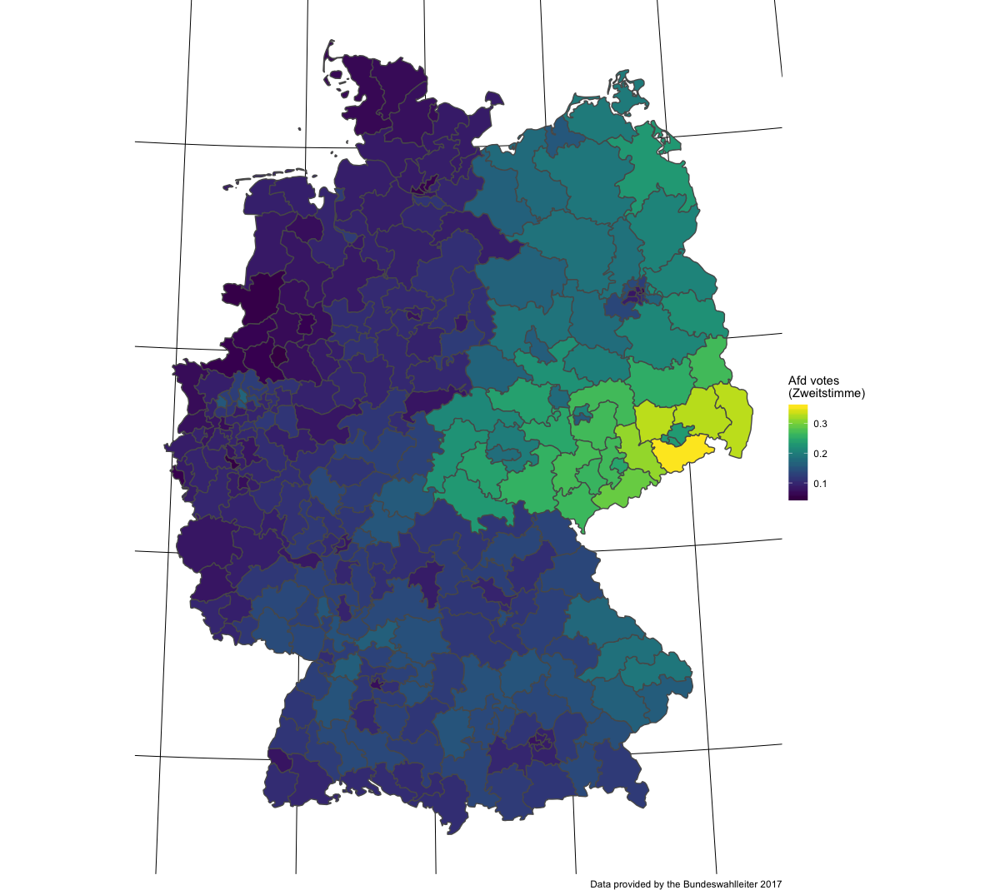

  ---
title: "Predictors of AfD party success in the 2017 elections"
subtitle: "A Bayesian modeling approach"
author: |
  Sebastian Sauer,
  Sandra Sülzenbrück,
  Yvonne Ferreira,
  Rüdiger Buchkremer
date: "FOM<br>DGPs 2018"
css: ["default-fonts", "default"]
output:
  xaringan::moon_reader:
    lib_dir: libs
    nature:
      highlightStyle: github
      highlightLines: true
      countIncrementalSlides: false
editor_options: 
  chunk_output_type: console
---

```{r setup, include=FALSE}
options(htmltools.dir.version = FALSE)

knitr::opts_chunk$set(
  comment = "#>",
  collapse = TRUE,
  message = FALSE,
  warning = FALSE,
  error = TRUE,
  cache = TRUE,
  echo = FALSE,
  out.width = "70%",
  fig.align = 'center',
  fig.width = 6,
  fig.asp =  0.618,  # 1 / phi
  fig.show = "hold",
  size = "tiny"
)
```


```{r libs, echo = FALSE}
library(tidyverse)
library(tidyr)
library(DiagrammeR)
library(rethinking)
library(knitr)
library(kableExtra)
```


class: center, middle, inverse

# Menace to society

Right-wing populism then and now


---


class: top, left
# Causes of 20th century world wars


- *nationalism*

- authoritarianism

- racism

- territorial disputes

- class conflicts

- crisis of capitalism


.small[.footnote[Source: Kershaw, I. (2016). To hell and back: Europe 1914-1949. New York City, NW: Penguin.]]


???

Image credit:Wikipedia, RIA Novosti archive, image #44732 / Zelma / CC-BY-SA 3.0


---


class: top, left

# Right-wing populism varies greatly, but...


- shows *anti-establishment* attitude

- the *people* is thought of as a *homogeneous body*

- *elites* are portrayed as *corrupt*, the *people* as *morally pure*

- favors *anti-pluralism*

- provides *low complexity solutions* to societal questions

- narrative of *"forgotton man Joe Plumber"*

- sees threat in *cultural outsiders*


.footnote[Source: Decker, F. (2003). Der neue Rechtspopulismus. Wiesbaden: VS Verlag für Sozialwissenschaften. Nicole Berbuir, Marcel Lewandowsky & Jasmin Siri (2015) The AfD and its Sympathisers: Finally a Right-Wing Populist Movement in Germany?, German Politics, 24:2,
154-178, DOI: 10.1080/09644008.2014.982546]


---

# AfD as a nucleus of the German right-wing movement


The AfD ...

- engages in *close contacts to far-right*

- recruits (ex-)*nazis*

- Indirect *support of violence* towards minorities:

>    "Wenn der Staat die Bürger nicht mehr schützen kann,
>    gehen die Menschen auf die Straße und schützen sich selber."

.small[— Tweet by Markus Frohnmaier (@Frohnmaier_AfD) on August, 26th 2018 in reaction to Chemnitz riots]

.footnote[Source: Fuchs, C., & Middelhoff, P. (2018, May 12). Neue Rechte - Bis in den letzten, rechten Winkel. Retrieved from https://www.zeit.de/politik/deutschland/2018-05/neue-rechte-verteilung-deutschlandkarte]


---

class: top, left
# Popular theories on AfD success

Populist party support is fueled by ...

- weak economy ("rust belt hypothesis")

- high immigration ("flooding hypothesis")

- cultural patterns ("Saxonia hypothesis")


.footnote[Source: Franz, Christian; Fratzscher, Marcel; Kritikos, Alexander S. (2018) : German right-wing party AfD finds more support in rural areas with aging populations, DIW Weekly Report, ISSN 2568-7697, Deutsches Institut für Wirtschaftsforschung (DIW), Berlin, Vol. 8, Iss. 7/8, pp. 69-79]


---

# Our research model


.center[
```{r research-model, echo =FALSE, fig.align='center', fig.width = 8, fig.asp =  .81, out.width = "100%"}
  
grViz(
  "digraph research_mdoel {
  
  
  graph [layout = dot,
  rankdir = LR];
  
  node [fontname = Helvetica, fontcolor = darkslategray,
  shape = rectangle, fixedsize = true, width = 3,
  color = darkslategray]; unemployment; foreigners; east_west; AfD

  node [fontname = Helvetica, fontcolor = darkslategray,
  shape = circle, fixedsize = true, width = 3,
  color = darkslategray]; economy; immigration; culture

  economy -> unemployment -> AfD
  immigration -> foreigners -> AfD
  culture -> east_west -> AfD}"

)
```
]


```{r}
library(DiagrammeRsvg)
p_pathmodel <- grViz(
  "digraph research_mdoel {
  
  
  graph [layout = dot,
  rankdir = LR];
  
  node [fontname = Helvetica, fontcolor = darkslategray,
  shape = rectangle, fixedsize = true, width = 3,
  color = darkslategray]; unemployment; foreigners; east_west; AfD

  node [fontname = Helvetica, fontcolor = darkslategray,
  shape = circle, fixedsize = true, width = 3,
  color = darkslategray]; economy; immigration; culture

  economy -> unemployment -> AfD
  immigration -> foreigners -> AfD
  culture -> east_west -> AfD}"

)

p_svg <- export_svg(p_pathmodel)

p_svg
write(p_svg, file = "img/p.svg")
dput(p_svg, file = "img/p_pathmodel.svg")
```


---

class: middle, center, inverse

# AfD votes, and socioenomic factors at the Bundestagswahl 2017


---


class: top, left
# AfD votes


```{r afd-votes, fig.align="center", out.width="70%", echo=FALSE}

```

 
---


# Unemployment


```{r unemp, out.width="70%", echo=FALSE}
knitr::include_graphics("img/unemp.png")
```
 

---

# Foreigners


```{r foreigner, fig.align="center", out.width="70%", echo=FALSE}
knitr::include_graphics("img/foreigner.png")
```


---


class: middle, center, inverse

# data analysis


---


class: top, left

# Data preparation

Data were...

- obtained from [Bundeswahlleiter 2017](https://www.bundeswahlleiter.de/bundestagswahlen/2017/ergebnisse.html)

- had no missings

- were z-transformed

- Details [here](https://data-se.netlify.com/2018/08/25/bayesian-modeling-of-populist-party-success-in-german-federal-elections/)

---

# Bayes modeling


- Stan via the R packages `rstan` and `rethinking`

- Hamiltonian Markov Chain Monte Carlo (MCMC)

- 2000 iterations,  2 chains, 1/2 burn-in

- Information criteria (WAIC) used for model comparison

- `r emo::ji("scream_cat")` some fitting issues with count models

- Details [here](https://data-se.netlify.com/2018/08/25/bayesian-modeling-of-populist-party-success-in-german-federal-elections/)


.footnote[Guideline: McElreath, R. (2016). Statistical rethinking. New York City, NY: Apple Academic Press Inc.]

---

# Model specification


$$\begin{aligned}
\text{AfD}_i &\sim \mathcal{N}(\mu_i, \sigma)\\
\mu_i &= \beta 0_{[east]} + \beta 1 \cdot \text{foreign_z} + \beta2 \cdot \text{unemp_z}\\
\beta0_{[east]} &\sim  \mathcal{N}(0, 1)\\
\beta1  &\sim  \mathcal{N}(0, 1)\\
\beta2  &\sim  \mathcal{N}(0, 1)\\
\sigma &\sim \mathcal{N}(0, 1)\\
\end{aligned}$$


```{r m9-stan, eval = FALSE}
afd_model1 <- map2stan(
  alist(
    afd_prop ~ dnorm(mu, sigma),
    mu <- beta0[east] +  beta1*for_z + beta2*unemp_z,
    beta1[east] ~ dnorm(0, 10),
    beta2 ~ dnorm(0, 1),
    beta3 ~ dnorm(0, 1),
    sigma ~ dnorm(0, 1)),
  data = d)
```


---


# Model diagnosis: traceplot

```{r echo = FALSE, out.width="70%"}

```

---


class: middle, center, inverse

# Results

---


# Model diagnosis and coefficients

```{r m9, echo = FALSE}
precis_m <- data.frame(stringsAsFactors=FALSE,
                                   coefficient = c("beta0[1]", "beta0[2]", "alpha", "beta1", "beta2", "sigma"),
                                          Mean = c(-0.45, 1.43, 0.07, -0.06, -0.21, 0.68),
                                        StdDev = c(5.74, 5.75, 5.74, 0.04, 0.05, 0.03),
                                    lower.0.89 = c(-9.26, -7.35, -9.54, -0.13, -0.28, 0.64),
                                    upper.0.89 = c(9.16, 11.05, 8.84, 0.02, -0.13, 0.72),
                                         n_eff = c(260.42, 259.13, 260.09, 520.19, 556.18, 623.57),
                                          Rhat = c(1, 1, 1, 1, 1, 1)
                                )
precis_m %>% 
  kable() %>% 
  kable_styling(bootstrap_options = c("striped", "hover"))
```

---

# The whole shabeng: Multi level wins


```{r all-models, echo = FALSE}
stan_model_comparison_output <- data.frame(stringsAsFactors=FALSE,
                                                model = c("m15_stan", "m13_stan", "m14_stan", "m12_stan", "m11c_stan",
                                                            "m16_stan",
                                                            "m10_stan", "m11d_stan",
                                                            "m9_stan", "m9a_stan",
                                                            "m11a_stan"),
                                                   WAIC = c(-1356.31784205804, -1298.49820142589, -1136.44582206627,
                                                            -951.153765538336,
                                                            -894.092069124956,
                                                            -885.56119550249,
                                                            -533.009659073194,
                                                            -509.224761429282,
                                                            625.563835717694,
                                                            808.284164686967,
                                                            813.893513007571),
                                                  pWAIC = c(21.7291386387061, 19.1741011984713, 6.52523148988784,
                                                            111.740970608157,
                                                            4.01588629691362,
                                                            3.34802468275307,
                                                            3.77060135704448,
                                                            0.593896976384456,
                                                            6.91816496103297,
                                                            4.72385419686823, 4.14317339018546),
                                                  dWAIC = c(0, 57.819640632151, 219.872019991768, 405.164076519703,
                                                            462.225772933083,
                                                            470.75664655555,
                                                            823.308182984846,
                                                            847.093080628757,
                                                            1981.88167777573,
                                                            2164.60200674501,
                                                            2170.21135506561),
                                                 weight = c(0.999999999999722, 2.78371368136707e-13, 1.8005181198249e-48,
                                                            1.04649859844468e-88,
                                                            4.25548153934816e-101,
                                                            5.97713466792663e-103,
                                                            1.66302819357717e-179,
                                                            1.13782301017939e-184, 0, 0, 0),
                                                     SE = c(34.9111213844142, 33.6278802775377, 30.2440918740764,
                                                            31.2746237932091,
                                                            37.0278863875357,
                                                            38.1543580648671,
                                                            16.015571120056,
                                                            10.8826325637384,
                                                            33.8682479354899, 34.0863132456256,
                                                            35.2184774434458),
                                                    dSE = c(NA, 15.0326492035245, 33.6368926133433, 37.1071256611068,
                                                            39.8550714648999,
                                                            40.5279274352836,
                                                            37.6625031153049,
                                                            36.3957930145737,
                                                            38.8184798663128,
                                                            39.3000040437219,
                                                            39.8646455645665)
                                           )


tibble::tribble(
       ~model,            ~predictors,
   "m15_stan", "state+for+unemp (ML)",
   "m14_stan",  "east+for+unemp (ML)",
   "m13_stan",           "state (ML)",
   "m10_stan",       "for+unemp+east",
    "m9_stan",     "for+unemp+east[]",
   "m12_stan",            "area (ML)",
  "m11c_stan",                "unemp",
   "m16_stan",     "null (intercept)",
   "m9a_stan",            "for+unemp",
  "m11a_stan",                  "for",
  "m11d_stan",                 "east"
  ) -> model_spec

stan_model_comparison_output %>% 
  full_join(model_spec) %>% 
  mutate_if(is.numeric, round, 2) %>% 
  select(model, predictors, everything()) -> stan_model_comparison_output2

```


```{r eval = FALSE}
print(xtable::xtable(stan_model_comparison_output2, type = "latex"))
```


```{r model-tabel, echo = FALSE}
stan_model_comparison_output2 %>% 
  knitr::kable() %>% 
  kableExtra:: kable_styling(bootstrap_options = c("striped", "hover")) %>% 
  row_spec(1, bold = T, color = "blue", background = "yellow")
```

---


# Model specification of most favorable model


$$\begin{aligned}
\text{AfD}_i &\sim \mathcal{N}(\mu_i, \sigma)\\
\mu_i &= \beta 0_{[state]} + \beta 1 \cdot \text{foreign_z} + \beta2 \cdot \text{unemp_z}\\
\beta0_{[state]} &\sim  \mathcal{N}(0, \sigma_2)\\
\beta1  &\sim  \mathcal{N}(0, 1)\\
\beta2  &\sim  \mathcal{N}(0, 1)\\
\sigma &\sim \mathcal{N}(0, 1)\\
\sigma_2 &\sim \mathcal{N}(0, 1)
\end{aligned}$$

---

# Coefficients of the most favorable model

```{r fav-model, echo=FALSE}

precis_m_fav <- data.frame(stringsAsFactors=FALSE,
                                       coefficient = c("beta0[1]", "beta0[2]", "beta0[3]", "beta0[4]", "beta0[5]",
                                                       "beta0[6]", "beta0[7]",
                                                       "beta0[8]", "beta0[9]",
                                                       "beta0[10]", "beta0[11]",
                                                       "beta0[12]", "beta0[13]",
                                                       "beta0[14]", "beta0[15]",
                                                       "beta0[16]", "sigma",
                                                       "sigma2", "beta1", "beta2"),
                                              Mean = c(0.15, 0.14, 0.11, 0.18, 0.09, 0.08, 0.14, 0.15, 0.09, 0.09,
                                                       0.12, 0.09, 0.25, 0.16,
                                                       0.07, 0.21, 0.02, 0.15,
                                                       -0.01, 0.02),
                                            StdDev = c(0.01, 0, 0.01, 0.01, 0.02, 0.01, 0.01, 0.01, 0, 0, 0.01,
                                                       0.01, 0.01, 0.01, 0.01,
                                                       0.01, 0, 0.03, 0, 0),
                                        lower.0.89 = c(0.14, 0.14, 0.1, 0.16, 0.06, 0.06, 0.13, 0.13, 0.08, 0.08,
                                                       0.11, 0.07, 0.24, 0.15,
                                                       0.06, 0.19, 0.02, 0.11,
                                                       -0.02, 0.01),
                                        upper.0.89 = c(0.16, 0.15, 0.12, 0.19, 0.11, 0.09, 0.14, 0.16, 0.09, 0.09,
                                                       0.13, 0.11, 0.26, 0.17,
                                                       0.08, 0.22, 0.03, 0.2,
                                                       -0.01, 0.02),
                                             n_eff = c(2000, 2000, 2000, 2000, 2000, 2000, 2000, 2000, 2000, 2000,
                                                       2000, 2000, 2000, 2000,
                                                       2000, 2000, 2000, 2000,
                                                       1957.68, 1702.87),
                                              Rhat = c(1, 1, 1, 1, 1, 1, 1, 1, 1, 1, 1, 1, 1, 1, 1, 1, 1, 1, 1, 1)
                                    )

precis_m_fav %>% 
DT::datatable(options = list(pageLength = 8))
```


---

# Traceplot of most favorable model

```{r m15trace}

```

---


# Checking model additivity assumption

```{r out.width="70%"}

```


.footnote[Gelman, A., & Hill, J. (2006). Data analysis using regression and multilevel/hierarchical models. Cambridge university press.]

---

# Posterior distributions of parameters

```{r out.width = "100%"}
knitr::include_graphics("img/post_params.png")
```


.footnote[Only level 1 parameters are shown.]
---


# Comparing model predictions


```{r pred-error, out.width="100%"}
knitr::include_graphics("img/model_pred.png")
```

---


# Comparing observed and estimated AfD votes


```{r model-obs-est, out.width="100%"}
knitr::include_graphics("img/Model-est-vs-obs-afd.png")
```


---


class: middle, center, inverse

# Conclusions

---


class: top, left


# Theoretical implications

- *Region related patterns* appear to play an important role
  - more than unemployment rate and foreigner rate
  - not yet well understood
  - rural? aged society?
  
- The present model is *simplistic*

- *Future elections* will provide interesting opportunities for model improvements


.footnote[Nicole Berbuir, Marcel Lewandowsky & Jasmin Siri (2015) The AfD and its Sympathisers: Finally a Right-Wing Populist Movement in Germany?, German Politics, 24:2, 154-178, DOI: 10.1080/09644008.2014.982546]

---


# Statistical implications


- *Observational research* is a very *limited* guide for *causal* interpretations

- *Fitting issues* with *count* models warrant more investigation

- *Overfitting* may be present (and underfitting)

---


# Good textbook


```{r rethink, fig.align="center", out.width = "30%", echo = FALSE}
knitr::include_graphics("https://images.tandf.co.uk/common/jackets/amazon/978148225/9781482253443.jpg")
```


---

class: middle, center, inverse

# Thank you

Sebastian Sauer
#### `r icon::fa("github", size = 1)` [sebastiansauer](https://github.com/sebastiansauer)
#### `r icon::fa("link", size = 1)` <https://data-se.netlify.com/>
#### `r icon::fa("envelope", size = 1)` ssauer@posteo.de
#### `r icon::fa("linkedin-in", size = 1)` [Sebastian Sauer](https://www.linkedin.com/in/dr-sebastian-sauer-4791762)
 
#### `r icon::fa("file", size = 1)` Get slides here: 

<http://data-se.netlify.com/slides/afd_dgps2018/afd_dgps2018.html#1>
  
CC-BY


.footnote[Built using R, RMarkdown, Xaringan. Inspiration from and thanks to [Yihui Xie](https://slides.yihui.name/2017-rmarkdown-UNL-Yihui-Xie.htm) and [Antoine Bichat](https://abichat.github.io/Slides/ScienceCommunicationSOTR/ScienceCommunicationSOTR.html), among others]
