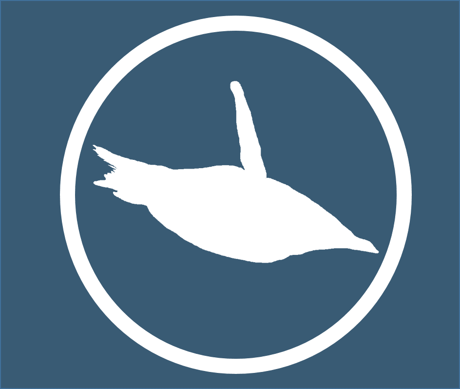

```{r setup-knitr, include=FALSE}
#options(htmltools.dir.version = FALSE)


knitr::opts_chunk$set(
  comment = "#>",
  collapse = TRUE,
  message = FALSE,
  warning = FALSE,
  cache = FALSE,
  echo = TRUE,
  out.width = "70%",
  fig.align = 'center',
  fig.width = 6,
  fig.asp =  .4,
  fig.show = "hold",
  size = "tiny",
  dpi=300
)


options(max.print = 999999,
        tibble.print_max = 300,
        tibble.print_min = 3)
```


```{r setup, echo = FALSE}
path_img <-  "https://raw.githubusercontent.com/sebastiansauer/modar/master/static/images/"
```


class: inverse

<br/>
<br/>

.right[
# Hands-on data exploration using R 

<br/>

### Sebastian Sauer
]

.right[
.tiny[
last update: `r Sys.Date()` 
]]


```{r out.width = "20%", fig.align='left', echo = FALSE, eval = FALSE}

```


---


class: inverse, center, middle

# Setup


---

class: top, left

## Overview


.Large[
.full-width[
.content-box-blue[

- Setup

- Tidyverse 101

- Data diagrams 101

- Case study
]
]
]


---


## whoami

```{r}
 system("whoami")
```


- R enthusiast

- Data analyst/scientist

- Professor at Ansbach University

---

## The lights are on

.center[

```{r echo = FALSE, fig.asp = 0.25}
library(leaflet)
popup = c("Sebastian")
leaflet(width = "100%") %>%
  setView(lng = 12, lat = 50, zoom = 05) %>%
  addProviderTiles("NASAGIBS.ViirsEarthAtNight2012") %>%
  addMarkers(lng = c(11.07752),
             lat = c(49.45421), 
             popup = popup)
```
]


---

## Upfront preparation


### Please install the following software upfront:

- [R](https://www.r-project.org/)
- [RStudio Desktop](https://www.rstudio.com/products/rstudio/download/)

Starting RStudio will start R automatically.


<br/>
<br/>

### Please also make sure:

- Your OS is up to date
- You have internet access during the course
- You reach the next power socket (maybe better bring a power cable)


---


## You, after this workshop


```{r out.width = "70%", echo = FALSE}
knitr::include_graphics("img/kermit.gif")
```


Well, kinda off...
