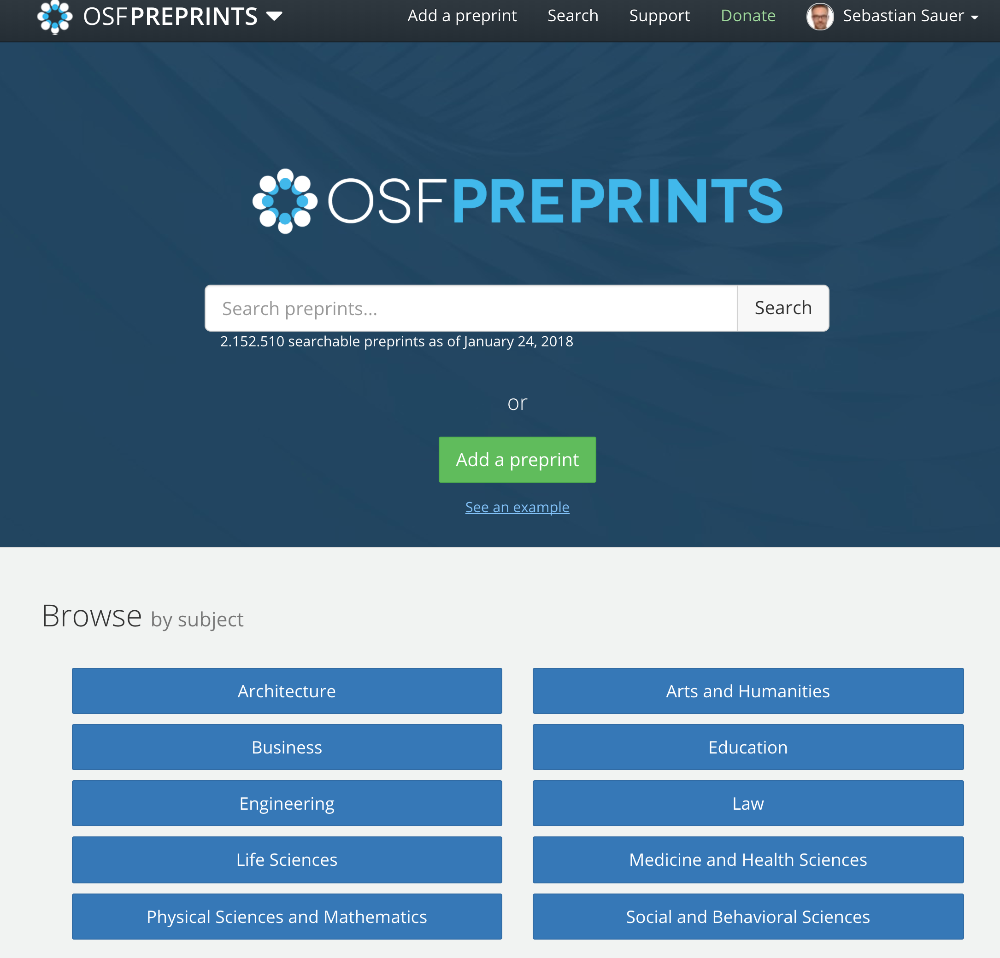

```{r setup, include=FALSE}
options(htmltools.dir.version = FALSE)
```


```{r knitr-setup, echo = FALSE,}
knitr::opts_chunk$set(echo = FALSE,
                      out.width = "70%",
                      fig.align = "center",
                      message = FALSE,
                      fig.asp = .618,
                      cache = TRUE)

```


```{r xaringan-themer, include = FALSE}
library(xaringanthemer)
mono_light(
  base_color = "#23395b",
  header_font_google = google_font("Josefin Sans"),
  text_font_google   = google_font("Montserrat", "300", "300i"),
  code_font_google   = google_font("Droid Mono"),
  link_color = "#9daed5"
)
```


```{r load-libs}
library(tidyverse)
library(mosaic)
library(plotly)
library(ggrepel)
library(knitr)
```


```{r, load_refs, echo=FALSE, cache=FALSE}
library(RefManageR)

bibfile <- "bib.bib"
BibOptions(check.entries = FALSE, 
         #  bib.style = "authoryear", 
         #  Cite.style = 'alphabetic', 
           style = "markdown",
           hyperlink = FALSE, 
           dashed = FALSE)
bib <- ReadBib(bibfile, check = FALSE)
```


class: center, middle, inverse


<style>
.remark-slide-number {
  position: inherit;
}

.remark-slide-number .progress-bar-container {
  position: absolute;
  bottom: 0;
  height: 4px;
  display: block;
  left: 0;
  right: 0;
}

.remark-slide-number .progress-bar {
  height: 100%;
  background-color: red;
}
</style>

# Überblick

---


## Ihr Paper wurde angenommen


```{r}
knitr::include_graphics("https://media.giphy.com/media/r9WS57qOqU1KU/giphy.gif")
```


---

## Link zu diesen Folien


sdfj

```{r eval = FALSE, echo = FALSE}
knitr::include_url("link_to_my_own_slides")
```

---

class: center, middle, inverse

# Schritt 1: Thema finden


---
class: top, left

## Man kann nicht alle Papers lesen


```{r sci-growth, echo = FALSE, fig.align = "center", dpi = 300}

year <- seq(from = 1980, to = 2019)

lit_growth <- function(x){
  702.880 * 2.718282^(0.029*(x-1980))
}


asof2019 <- 702.880 * 2.718282^(0.029*(2019-1980))

npubs <- lit_growth(year)

p_growth <- ggplot(data.frame(year, npubs), aes(x = year, y = npubs)) +
  geom_line() +
  labs(x = "Jahr",
       y = "Anz. von (neuen) Publikationen [in 1000]",
       title = "ca. 8% Wachstum p.a.; Verdopplungszeit: ~9 Jahre",
       caption = "Ab 2013 nur prolongiert") +
  geom_hline(yintercept = asof2019,
             linetype = "dashed",
             color = "grey40") +
  annotate(geom = "point", x = 2019, y = asof2019,
           color = "red", alpha = .5,
           size = 7) +
  annotate(geom = "label_repel", label = round(asof2019),
           x = 2019, y = asof2019)

p_growth

```

<small>
`r Citet(bib, c("bornmann2015growth", "Larsen:2010aa"))`
</small>


<!-- Die Literaturmenge verdoppelt sich alle 9 Jahre -->

---

## Wer liest 50 Milllionen Papers?


```{r out.width="40%"}

```


<!-- ca. 30.000 Journals -->


<small>
Bildquelle: https://www.buzzfeednews.com/article/alexkasprak/best-science-memes/
</small>


---

## Lesen Sie (nur) zu Ihrem Steckenpferd


```{r scho-ex, echo = FALSE, out.width = "100%"}

knitr::include_graphics("https://media.giphy.com/media/3oFzlYqs3jaI90KaL6/giphy.gif")

```


[Google Scholar](https://scholar.google.de/  ) ist eine nützliche Suchmaschine. 

---


## Nutzen Sie eine Software zur Literaturverwaltung

- [Zotero](https://www.zotero.org/) (open source `r emo::ji("v")`)
- [Mendeley](https://www.mendeley.com/) (zu Elsevier `r emo::ji("moneybag")`)
- [JabRef](http://www.jabref.org/) (kein Word-Plugin `r emo::ji("nerd_face")`)


Es gibt [mehr Zitierstile](https://www.zotero.org/styles), als es Fachzeitschriften gibt...


---

## Zotero

.center[
```{r}
knitr::include_url("https://www.zotero.org/", height = "400px")
```
]


---

## Befüllen Sie Ihre Literatur-Datenbank per DOI-Suche

```{r}

```

---


## Soziale Medien für Wissenschaftler

- [Blogs](https://data-se.netlify.com/)
- [Twitter](https://twitter.com/)
- [Researchgate](https://www.researchgate.net/)
- [Medium](https://medium.com/)
- [Facebook](hptts://facebook.com/)


---


##  Große Unis bieten Zugang zu vielen Papers

```{r stabi, echo = FALSE, out.width = "60%"}


```


<!-- ## Lesen Sie nach dem Pryamidenprinzip -->

<!-- - Titel -->
<!-- - Absctract -->
<!-- - Überschriften -->
<!-- - Diagramme -->
<!-- - Informationsdichte Abschnitte -->

---

## Suchen Sie interessante Journals 

```{r sjr, echo = FALSE}


```

<small>
http://www.scimagojr.com/journalrank.php
</small>


---


## Trauen Sie keinem Impact Factor 

```{r power, echo = FALSE}


```


Wenig Zusammenhang zwischen IF und statistischer Power

<small>
@Brembs2013, Abbildung 2, CC-BY
</small>

---

## Der Impact Factor sagt wenig über einzelne Papers aus

```{r cit-distrib, echo = FALSE}


```

Nature: IF = 38.1, 75% der Artikel unterhalb des IF  
Science: IF = 34.7, 76% der Artikel unterhalb des IF  
PLOS ONE: IF = 3.1, 72% der Artikel unterhalb des IF  


<small>
`r Citet(bib, "lariviere2016simple")`
</small>

---

## Zielen Sie auf Journals mit hohem Impact Factor


```{r if-reject, echo = FALSE, out.width = "70%"}

knitr::include_graphics("img/rejection-rate.png")

```

<small>
https://blog.frontiersin.org/2015/12/21/4782/ 
</small>

---

class: center, middle, inverse

# Schritt 2: Studie planen

---

## Kochen Sie eine Studie nach

*Procedure*

Subjects were presented the stimuli on an iMac desktop. Each subject saw all four looks for each of the 25 models in a randomized sequence and rated them for attractiveness, likeability, trustworthiness, and competence using a 7-point "slider scale" ranging from end points labeled "not at all" to "highly/ extremely." 

<!-- `r Citet(bib, "Etcoff2011")` -->


---

## Melden Sie Ihre Studie an


```{r prereg, echo = FALSE}

knitr::include_graphics("img/osf_prereg.png")

```


https://osf.io/prereg/  


<!-- ## Verringern Sie die Researcher Degrees of Freedom -->

---


## Bedenken Sie Falsch-Positiv-Befunde 

```{r echo = FALSE, dpi = 300}
m1 <-rnorm(n = 1000, mean = 0, sd = 1)
m2 <-rnorm(n = 1000, mean = 0, sd = 1)

df <- data_frame(
  m1 = m1,
  m2 = m2,
  diff = m1 - m2,
  sig = ifelse(abs(diff) > 1.96, "sig", "ns")
)

p_zufall <- ggplot(df) +
  aes(x = diff, fill = sig) +
  geom_histogram() +
  geom_vline(xintercept = c(-1.96, 1.96), linetype = "dashed") +
  labs(fill = "Signifikanz")

p_zufall
```


---

## Richtlinien für mehr weniger Falsch-Positiv-Befunde

1. Stichprobengröße vorab festlegen
2. Auf ausreichende Power achten (cell size > 20)
3. Alle Variablen vorab festlegen
4. Studienablauf vorab festlegen

<small>
`r Citet(bib, "Simmons2011c")`, [Volltext hier](http://journals.sagepub.com/doi/abs/10.1177/0956797611417632?url_ver=Z39.88-2003&rfr_id=ori:rid:crossref.org&rfr_dat=cr_pub%3dpubmed), `r Citet(bib, "Wicherts:2016aa")`, [Volltext hier](https://www.frontiersin.org/articles/10.3389/fpsyg.2016.01832/full)

</small>

---

## Berechnen Sie Power (oder Präzision) Ihrer Studie vorab

```{r pwr, echo = TRUE}
library(pwr)
pwr.t.test(n = 30, d = .3)
```

---


## Effektstärken der freien Wildbahn sind klein

- klein (25. Perzentil): $\rho = 0.1$
- mittel (50 Perzentil): $\rho = 0.2$
- groß (75. Perzentil): $\rho = 0.3$


<small>
`r Citet(bib, "gignac2016effect")`
</small>


---

## Denken Sie an Datenschutz und sonstige Ethikbelange

>   Wenn Daten vollständig anonymisiert sind, z.B. Fragebogendaten oder Daten aus Experimentalreihen, muss eine entsprechende Einwilligung nicht notwendigerweise eingeholt werden, da keine individuellen Zuordnungen mehr möglich sind. In begründeten Zweifelsfällen sollte die lokale Ethikkommission bzw. die Ethikkommission der DGPs konsultiert werden


<small>
`r Citet(bib, "Schonbrodt:2016aa")`
</small>

---

## Arbeiten Sie mit Kollegen und Studierenden zusammen


```{r out.width="50%"}
knitr::include_graphics("https://imgs.xkcd.com/comics/interdisciplinary.png")
```


<small>
https://xkcd.com/755/ 
</small>


---

class: center, middle, inverse

# Schritt 3: Daten auswerten

---

## Mit Excel sind Fehler schwer zu finden

```{r excel1, echo = FALSE}


```


`r Citet(bib, "herndon2013does")`

---

## Das Problem ist, dass Excel Daten und Analyse vermengt.


```{r excel2, echo = FALSE}

knitr::include_graphics("img/excel2.png")

```


---


## Bauen Sie keine komplexen Excel-Tabellen

```{r}
knitr::include_graphics("https://imgs.xkcd.com/comics/algorithms.png")
```


---


## Nutzen Sie Syntaxsprachen wie R

Auf Deutsch:
```{r r-ex, eval = FALSE, echo = TRUE}

meine_rohdaten %>% 
  lies_sie_ein() %>% 
  entferne_fehlende_Werte() %>% 
  gruppiere_nach(geschlecht) %>% 
  berechne(umsatz_mw = mittel(umsatz_produkte)) -> meine_daten
```

<br>
<br>

Auf Errisch:
```r
my_rawdata %>% 
  read_csv() %>% 
  drop_na() %>% 
  group_by(sex) %>% 
  summarise(umsatz_mw = mean(umsatz_produkte)) -> my_data
```

---

## Rücken Sie Diagramme ins Zentrum Ihrer Analyse


```{r p-circ, echo = FALSE, out.width = "50%"}


```

<small>
http://zuguang.de/circlize/
</small>

---

## Rücken Sie Diagramme ins Zentrum Ihrer Analyse 2

```{r p-nuts, echo = FALSE, out.width = "50%"}

knitr::include_graphics("img/nuts.png")

```


---

## Lesen Sie ein R-Buch 


```{r rfuerds, echo = FALSE, out.width = "30%"}

knitr::include_graphics("https://images.springer.com/sgw/books/medium/9783658215866.jpg")

```


---

class: center, middle, inverse

# Schritt 4: Manuskript schreiben

---

## Kopieren Sie die alten Meister 

```{r}
knitr::include_graphics("http://library.uthscsa.edu/wp-content/uploads/2012/03/Durer6.jpg")
```


---


## Vermeiden Sie Ablenkungen


.center[
```{r}
knitr::include_url("https://blank.org/")
```

]


---


## Schreiben Sie im Häusle-Bauer-Stil

| Häusle-Bauer    | Paper-Schreiber |
|-----------------|-----------------|
| `r icon::fa("home", size = 3)`| `r icon::fa("book", size = 3)`  |
| Entwurf         | Notizen |
| Plan            | Gliederung |
| Rohbau          | Stichpunkte |
| Innenausbau     | Ausformulieren |
| Verputzen       | Formatieren |
| Einziehen!      | Einreichen! |

---

## Machen Sie Notizen, bevor Sie Folien malen

```{r SCRIBBLE, echo = FALSE}


```


---

## Schicken Sie das Manuskript NICHT per MAil


```{r EMAIL1, echo = FALSE}

knitr::include_graphics("img/email1-crop.png")

```

---


## Nutzen Sie eine gemeinsame Datei-Ablage


```{r server, echo = FALSE}

knitr::include_graphics("img/server-crop.png")

```


---


## Schreiben Sie mit Rmarkdown


<iframe src="https://player.vimeo.com/video/178485416" width="700" height="394" frameborder="0" style="margin-bottom: 2em;" webkitallowfullscreen mozallowfullscreen allowfullscreen>
</iframe>

https://github.com/rstudio/rmarkdown 

---


## Dateien versionieren - kann helfen


```{r out.width="50%"}
knitr::include_graphics("https://imgs.xkcd.com/comics/documents.png")
```


 


---

## Versionieren Sie mit `git`

```{r out.width="50%"}
knitr::include_graphics("https://cdn-images-1.medium.com/max/1600/0*Xokg4oWGLB96vhyW.")
```


---

## Git hilft, Änderungen im Text zu dokumentieren


```{r}
knitr::include_graphics("https://cdn-images-1.medium.com/max/1600/1*Ww0myq8v2Ot3pqaptPBt1Q.png")
```


---


## Titel: prägnant und ansprechend


>    "You probably think this paper's about you: narcissists' perceptions of their personality and reputation."

---
  
## Der Abstract ist das Aushängeschild

```{r tweet, echo = FALSE, out.width = "60%"}


```


---
  
## Markdown 


http://markdownlivepreview.com/
<!-- https://jbt.github.io/markdown-editor/  -->
<!-- https://dillinger.io/   -->
<!-- http://markdown.pioul.fr/ -->

---

## Template `papaja` für APA-Formatierung

```{r eval = FALSE, echo = TRUE}
devtools::install_github("crsh/papaja")
```

[RMarkdown-Datei](https://raw.githubusercontent.com/crsh/papaja/master/example/example.Rmd)

[PDF-Ausgabe](https://raw.githubusercontent.com/crsh/papaja/master/example/example.pdf)

https://github.com/crsh/papaja


---


## Fügen Sie die 21-Word-Lösung hinzu

>    We report how we determined our sample size, all data exclusions (if any), all manipulations, and all measures in the study.


<small>
`r Citet(bib, "Simmons2012")`
</small>


---

class: center, middle, inverse

# Schritt 5: Manuskript einreichen


---


## Erstellen Sie sich eine ORCID `r icon::ai("orcid")`


>   ORCID provides a persistent digital identifier that distinguishes you from every other researcher and, through integration in key research workflows such as manuscript and grant submission, supports automated linkages between you and your professional activities ensuring that your work is recognized. 


https://orcid.org/  


---

## Beurteilen Sie die Qualität Ihres Manuskripts

- [STROBE (Beobachtungsstudien, z.B. Korrelation)](https://www.strobe-statement.org/index.php?id=available-checklists)
- [CONSORT (Experimentelle Studien)](http://www.consort-statement.org/checklists/view/32--consort-2010/66-title)


---

## Laden Sie Ihren Preprint auf einen Open Access Server

```{r osf-preprint, echo = FALSE, out.width = "60%"}



```


---

## Machen Sie Ihre Daten und Ihr weiteres Material zugänglich

```{r open, echo = FALSE, out.width = "20%", results = "hold"}

knitr::include_graphics(c("img/opendata.png", "img/openmaterials.png"))

```


Beispiel: [Datensatz zu Extraversion](https://osf.io/4kgzh/)  


---

## Nutzen Sie das Open Science Framework `r icon::ai("osf")` (OSF)

```{r osf, echo = FALSE}

knitr::include_graphics("img/osf.png")

```

https://osf.io/  


---

## Schreiben Sie in den sozialen Netzwerken

```{r data-se, echo = FALSE}

knitr::include_url("https://data-se.netlify.com/")

```


---


## Klären Sie, wer Autor ist

Autoren sollen vier Kriterien erfüllen:

1. Substanziell beitragen zur Entwicklung der Studie oder Datenerhebung oder Datenanalyse oder Interpretation der Ergebnisse UND
2. Das Manuskript (in Teilen) schreiben oder kritisch revidieren UND
3. Der finalen (zu publizierenden Version) explizit zustimmen UND
4. Zustimmen, für alle Aspekte der Publikation verantwortlich zu sein (hinsichtlich Integrität, Richtigkeit, Genauigkeit etc.)

Ansonsten *acknowledgement*


<small>
http://www.icmje.org/recommendations/browse/roles-and-responsibilities/defining-the-role-of-authors-and-contributors.html
</small>

---

## Schauen Sie Ihren h-Index nach (bei Google Scholar)


```{r H-index, echo = FALSE, out.width = "50%"}


```


<small>
H-index. (2018, January 24). In Wikipedia, The Free Encyclopedia. Retrieved 12:08, January 25, 2018, from https://en.wikipedia.org/w/index.php?title=H-index&oldid=822182293
</small>

---

## Erstellen Sie sich ein Google-Scholar-Profil


```{r SCHOLAR, echo = FALSE}


```


https://scholar.google.de/


---

## Ertragen Sie die Hinweise der Reviewer 


>  The manuscript reads much like an unrevised masters level paper. 


>  You do not use the empirical data for the analysis, but the empirical data uses you.

<!-- >  The author does not exhibit adequate acquaintance with the subject under discussion, the scholarship on it, the structure of logical argument, or the writing of English.  -->

>  This article is on an interesting topic. Unfortunately there is no more positive to say about this manuscript. 


<small>
https://shitmyreviewerssay.tumblr.com/
</small>

---

class: center, middle, inverse


# Zusammenfassung

---

background-image: url("http://bit.ly/cs631-donkey")
background-size: cover

---
class: center, middle, inverse

# Anhang

---

## Danke für Ihre Aufmerksamkeit  


Sebastian Sauer

#### `r icon::fa("github", size = 1)` [sebastiansauer](https://github.com/sebastiansauer)
#### `r icon::fa("link", size = 1)` <https://data-se.netlify.com/>
#### `r icon::fa("envelope", size = 1)` ssauer@posteo.de
#### `r icon::fa("linkedin-in", size = 1)` [Sebastian Sauer](https://www.linkedin.com/in/dr-sebastian-sauer-4791762)
 
#### `r icon::fa("file", size = 1)` Get slides here: 

<http://data-se.netlify.com/slides/URLYYYYY>
  
CC-BY


---

## Empfohlene Literatur

1. The Seven Deadly Sins of Psychology, `r Citet(bib, "Chambers:2017aa")`
2. How to be a Modern Scientist, `r Citet(bib, "Leek:2016aa")`
3. R für Data Science, `r Citet(bib, "rfuerds")`
4. Modern Datenanalyse mit R `r emo::ji("nerd_face")`


---

## Zitierte Literatur
<P ALIGN=LEFT>

<font size="1">

```{r, 'refs', results='asis', echo=FALSE}
PrintBibliography(bib)
```

</P>


