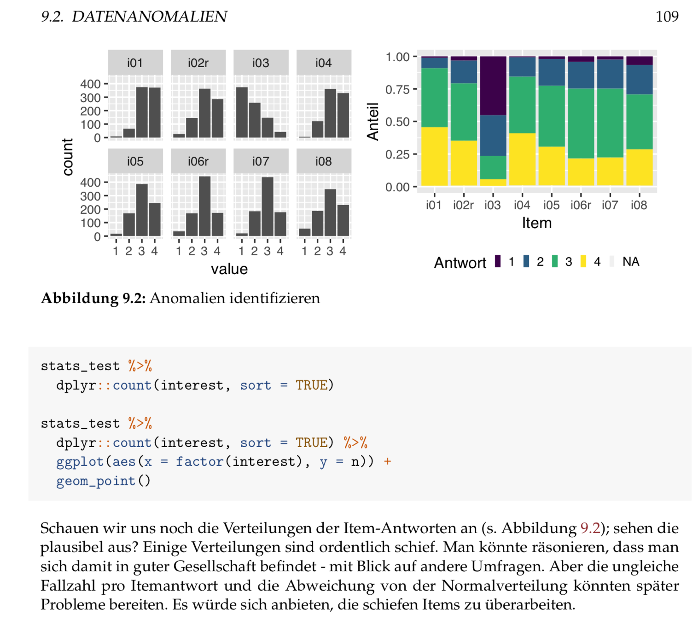

```{r setup, include=FALSE}
options(htmltools.dir.version = FALSE)

knitr::opts_chunk$set(
  comment = "#>",
  collapse = TRUE,
  message = FALSE,
  warning = FALSE,
  error = TRUE,
  cache = TRUE,
  echo = FALSE,
  out.width = "70%",
  fig.align = 'center',
  fig.width = 6,
  fig.asp =  .7,  #0.618,  # 1 / phi
  fig.show = "hold",
  size = "tiny"
)


#proj_dir <-  paste0(rprojroot::find_rstudio_root_file())

proj_dir <- "/Users/sebastiansaueruser/Documents/Publikationen/blog_ses/data_se/static/slides/rmd-writing/"

```


```{r libs, echo = FALSE}
library(tidyverse)
library(tidyr)
library(DiagrammeR)
library(rethinking)
library(knitr)
library(kableExtra)
library(ggmap)
library(leaflet)

```


class: inverse, center, middle

# What is RMarkdown?


---


class: top, left

# Markdown is not HTML

```{html, eval = FALSE, echo = TRUE}
<ul class="nav-links">
    
    <li><a href="/about/">About</a></li>
    
    <li><a href="/">Blog</a></li>
    
    <li><a href="/privacy/">Data privacy</a></li>
    
  </ul>
</nav>
      </header>
<main class="content" role="main">
  <article class="article">
    <span class="article-duration">40 min read</span>
    <h1 class="article-title">Bayesian modeling of populist party success in German federal elections - A notebook from the lab</h1>
    <span class="article-date">2018/08/25</span>
    <div class="article-content">
      <p>Following up on an <a href="https://data-se.netlify.com/2017/10/10/afd-map/">earlier post</a>, we will model the voting success of the (most prominent) populist party, AfD, in the recent federal elections. This time, Bayesian modeling techniques will be used, drawing on the <a href="https://xcelab.net/rm/statistical-rethinking/">excellent textbook</a> my McElreath.</p>
<p>Note that this post is rather a notebook of my thinking, doing, and erring. I’ve made no efforts to hide scaffolding. I think it will be confusing to the uniniate and the initiate as well …</p>
<hr />
```

---

# Markdown is not Latex

```{tex, eval = FALSE, echo = TRUE}
\makeatletter
\newenvironment{kframe}{%
\medskip{}
\setlength{\fboxsep}{.8em}
 \def\at@end@of@kframe{}%
 \ifinner\ifhmode%
  \def\at@end@of@kframe{\end{minipage}}%
  \begin{minipage}{\columnwidth}%
 \fi\fi%
 \def\FrameCommand##1{\hskip\@totalleftmargin \hskip-\fboxsep
 \colorbox{shadecolor}{##1}\hskip-\fboxsep
     % There is no \\@totalrightmargin, so:
     \hskip-\linewidth \hskip-\@totalleftmargin \hskip\columnwidth}%
 \MakeFramed {\advance\hsize-\width
   \@totalleftmargin\z@ \linewidth\hsize
   \@setminipage}}%
 {\par\unskip\endMakeFramed%
 \at@end@of@kframe}
\makeatother
```

---


# Last time I tried to tweak some details in my Latex document

.center[

]

---


# Markdown is simple markup 


.pull-left[
```{markdown, eval = FALSE, echo = TRUE}


# This is a title


This is a sentence.

Now a list begins:
  
- no importance
- again
- repeat
  
1. first
2. second
3. third

__bold__, _italic_, ~~strike through~~
```
]


.pull-right[
# This is a title
This is a sentence.
Now a list begins:
  
- no importance
- again
- repeat

A numbered list:

1. first
2. second
3. third

__bold__, _italic_, ~~strike through~~
]

---


# Want some more?

.pull-left[
```{markdown, eval = FALSE, echo = TRUE}
# Title level 1


## Title level 2


Link:  [my blog](https://data-se.netlify.com/)

Citation: [@Xie2018]

Image: 


```
]


.pull_right[
# Title level 1
## Title level 2

Link:  [my blog](https://data-se.netlify.com/).

Citation: (Xie & Allaire, 2018)

Image: 

]


---
# I know you love your formulas


```{r comment=NA,echo=FALSE}
cat('$$e^{\\ln{e}} = e$$')
```


--

$$e^{\ln{e}} = e$$

--


```{r comment=NA,echo=FALSE}
cat('$$\\frac{\\sum (\\bar{x} - x_i)^2}{n-1}$$')
```

--

$$\frac{\sum (\bar{x} - x_i)^2}{n-1}$$

--

ad nauseam


Enter $\LaTeX$ code in the same way.

---


# Quickstart with Markdown

.center[

]


---


# Markdown's Philosophy


## Keep. it. Simple.

- No formating/styling. Content only

- Pleasant to the eye

- Portable

---

# That's *R* Markdown (.Rmd)


.center[

]


---

# Simple R Markdown code


```{r comment=NA,echo=FALSE, eval = FALSE}
cat('Admire this curve: \n```{r echo = FALSE}\ncurve(dnorm(x), from = -2, to = 2)\n```')
```

```
Admire this curve:
curve(dnorm(x), from = -2, to = 2) 
```  

--

Admire this curve:
```{r echo = FALSE, out.width="50%"}
curve(dnorm(x), from = -2, to = 2)
```


---

# Metadata is referenced in a separate container called YAML


```
---
```

```
author: Sebastian Sauer
date: 2018-09-20
title: Some title
output_format: pdf_document
bibliography: cited_papers.bib
csl: apa.csl
```

```
---
```

```
Now normal text.
```

---


class: center, middle, inverse

# What's RMarkdown good for?

---


class: top, left

# Websites/ Blogs


---

# Reports


---

# Books


---


# Slides


<br>
<br>
<br>
<br>
<br>

.center[
`r emo::ji("ok_hand")`
]

---


class: center, middle, inverse

# Why should I use it?


---


class: top, left


# RMarkdown has more power

```{r}
knitr::include_graphics("imgs/git-push-force.gif")
```


---


# But I love MS Word...

Start writing with Word. Keep on writing. Sooner or later ...


```{r out.width = "80%"}
knitr::include_graphics("imgs/kid-waves.gif")
```


Markdown does not choke at big documents.


---

# Put code and text in the same document

```{r echo = FALSE, comment = NA}
cat("The median reaction time was `r rt_md` sec.")
cat("It was incredibly significant (p < \`r. very_low_p`).")
cat("We made science great again.")
```


--


The median reaction time was 0.420 sec.

It was incredibly significant (p < .001).

We made science great again.


## `r emo::ji("sparkling_heart")` no more copy-paste-errors. More reproducible


---


# `r icon::ii("social-windows")` Word's typography is so 80ies


`r icon::ii("social-windows")` Word :

```{r out.width = "70%"}

```


`r icon::ii("social-markdown")` Latex (Markdown):

```{r out.width = "70%"}

```


---


# Do cool stuff


```{r leaflet, echo=FALSE, eval = TRUE}
library(leaflet)
library(widgetframe)


df <- data.frame(
  name = c("Frankfurt"),
  lat = c(50.11092),
  long = c(8.6832),
  stringsAsFactors = FALSE)

l <- leaflet(df) %>% 
  addTiles() %>%
  addCircleMarkers(~long, ~lat, 
				   popup = ~name,
				   stroke = FALSE,
				   fillOpacity = 1)

frameWidget(l)
```


---

# Interactive diagrams

```{r gganimate}
library(gapminder)
library(ggplot2)
library(gganimate)

ggplot(gapminder, aes(gdpPercap, lifeExp, size = pop, colour = country)) +
  geom_point(alpha = 0.7, show.legend = FALSE) +
  scale_colour_manual(values = country_colors) +
  scale_size(range = c(2, 12)) +
  scale_x_log10() +
  facet_wrap(~continent) +
  # Here comes the gganimate specific bits
  labs(title = 'Year: {frame_time}', x = 'GDP per capita', y = 'life expectancy') +
  transition_time(year) +
  ease_aes('linear')
```

.center[

]

---


class: middle, center, inverse

# Sample project

```{r out.width = "30%"}
knitr::include_graphics("imgs/bookdown-logo.png")
```


---


class: top, left

# Book "Moderne Datenanalyse mit R"

- 500 pages
- ~200 figures
- ~200 R listings

Big thing.

No choking, but long compilation.


```{r out.width = "50%"}
knitr::include_graphics("imgs/modar.png")
```


---

# Chapter file


```

rmd_files: 
[
  "index.Rmd",
  "01_Statistik_heute.Rmd",
  "02_Hallo_R.Rmd",
  "03_R_starten.Rmd",
  "04_Erstkontakt.Rmd",
  # "05_Datenstrukturen.Rmd",
  "06_Datenimport_und_export.Rmd",

  ...

]
```

---

# Config file

```
title: "Moderne Datenanalyse mit R"
subtitle: "Entwurf"
author: "Sebastian Sauer"
lang: de-De
documentclass: book
classoption: a4paper
fontsize: 11pt
fontfamily: mathpazo

...

```

---

# Sample page

```{r out.width="70%"}

```


---


class: middle, center, inverse

# Now what?

---

# Get going with this book

```{r out.width="30%"}
knitr::include_graphics("imgs/rmd-def-cover.jpg")
```

---

# Or with this one

```{r out.width="30%"}
knitr::include_graphics("imgs/bookdown-cover.jpg")
```

---


# Disclaimer: There may be issues at times

```{r}
knitr::include_graphics("imgs/overhead-bin.gif")
```

`r icon::fa("stack-overflow", size = 1)` [StackOverflow](https://stackoverflow.com/) is your friend

---

class: center, inverse, middle

# Thank you

Sebastian Sauer
#### `r icon::fa("github", size = 1)` [sebastiansauer](https://github.com/sebastiansauer)
#### `r icon::fa("link", size = 1)` <https://data-se.netlify.com/>
#### `r icon::fa("envelope", size = 1)` ssauer@posteo.de
#### `r icon::fa("linkedin-in", size = 1)` [Sebastian Sauer](https://www.linkedin.com/in/dr-sebastian-sauer-4791762)

#### `r icon::fa("file", size = 1)` Get slides here: 

<http://data-se.netlify.com/slides/rmd-writing/rmd-writing_dgps2018.html#1>

CC-BY


.footnote[Built using R, RMarkdown, Xaringan. Inspiration from and thanks to [Yihui Xie](https://slides.yihui.name/2017-rmarkdown-UNL-Yihui-Xie.htm) and [Antoine Bichat](https://abichat.github.io/Slides/ScienceCommunicationSOTR/ScienceCommunicationSOTR.html), among others]